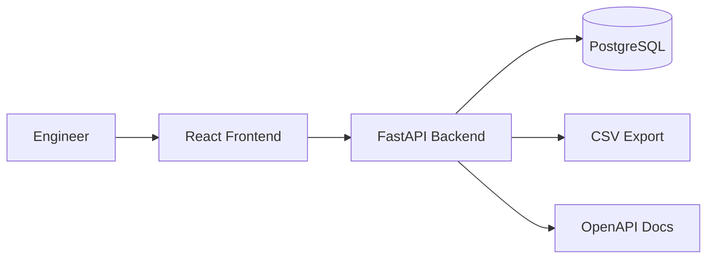
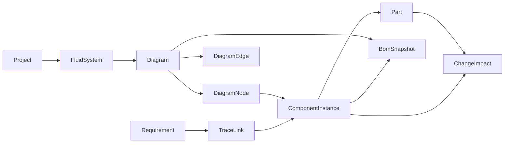
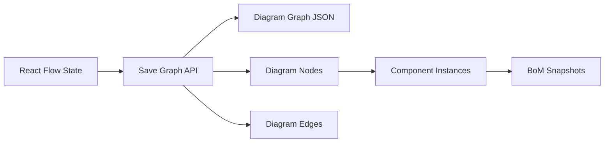

# FSDP MVP Architecture

The MVP is a split web application with a FastAPI backend, PostgreSQL database, and React frontend. It implements the first useful digital-thread workflow for fluid-system development: project, fluid system, P&ID graph, parts, component instances, requirements, trace links, BoM snapshots, and change impact.

For implementation details, see [implementation.md](implementation.md). For product scope, see [requirements.md](requirements.md).

## System Context

## Digital Thread

The first implementation connects these objects:

The diagram editor stores its full graph payload for round-tripping through React Flow. The backend also persists normalized nodes, edges, and component instances so BoMs, requirements, and impact analysis can query engineering objects directly.

## Data Ownership

The backend is the source of truth for engineering objects. The frontend owns interactive editing state while the user is manipulating the canvas, but saved diagram data is persisted through the backend.

## MVP Boundaries

The MVP intentionally avoids full PLM behavior, enterprise approval routing, and detailed physics solvers. Those features should build on top of the same traceable object model after the thin workflow is usable.

Implemented now:

- Project and fluid-system management.
- P&ID graph creation, saving, reopening, and deletion.
- Component catalog management.
- Component placement on persisted diagram nodes.
- Requirements management.
- Requirement-to-component trace links.
- BoM generation and CSV export.
- Basic change impact for selected parts and components.

Deferred:

- Pressure-drop analysis.
- Relief sizing.
- Trapped-volume analysis.
- Hazard tracking.
- Verification matrix.
- Certification package generation.
- Configuration baselines and release workflows.
