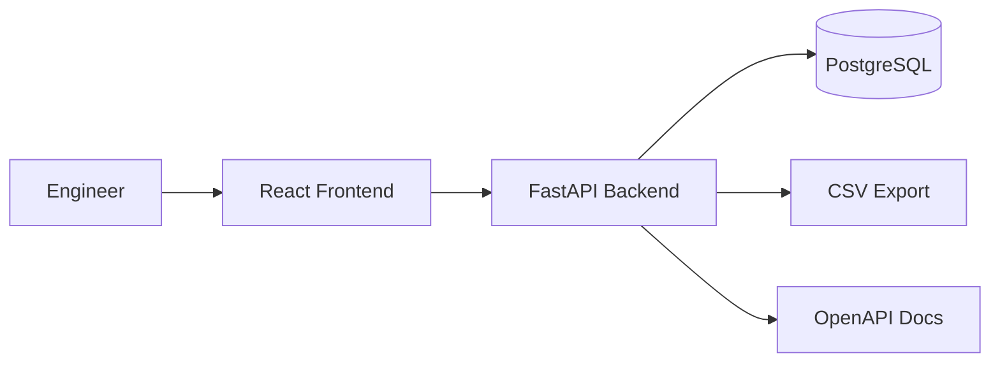
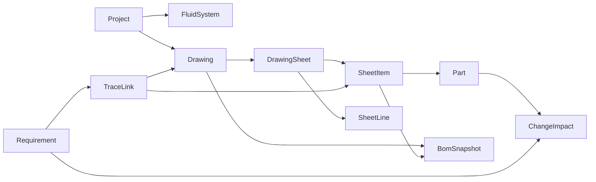
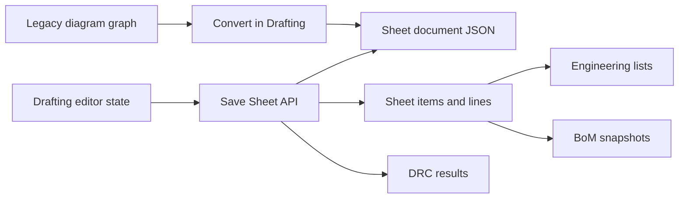

# FSDP MVP Architecture

The MVP is a split web application with a FastAPI backend, PostgreSQL database, and React frontend. It implements the first useful digital-thread workflow for fluid-system development: project, fluid system, P&ID drawings, parts, requirements, trace links, BoM snapshots, and change impact.

For implementation details, see [implementation.md](implementation.md). For product scope, see [requirements.md](requirements.md).

## System Context

```mermaid
flowchart LR
  Engineer[Engineer] --> Frontend[React Frontend]
  Frontend --> Backend[FastAPI Backend]
  Backend --> Database[(PostgreSQL)]
  Backend --> Exports[CSV Export]
  Backend --> OpenApi[OpenAPI Docs]
```

## Digital Thread

The first implementation connects these objects:

```mermaid
flowchart LR
  Project --> FluidSystem
  Project --> Drawing
  Drawing --> DrawingSheet
  DrawingSheet --> SheetItem
  DrawingSheet --> SheetLine
  SheetItem --> Part
  Requirement --> TraceLink
  TraceLink --> SheetItem
  TraceLink --> Drawing
  Drawing --> BomSnapshot
  SheetItem --> BomSnapshot
  Part --> ChangeImpact
  Requirement --> ChangeImpact
```

Drafting is the only P&ID editor. A sheet stores its schematic document; on save the client also sends the sheet index (one row per tagged item and line) and the design rule check results, so lists, BoMs, trace links, and impact analysis query engineering objects directly.

Diagrams from the retired React Flow editor (`Diagram`, its nodes, edges, and `ComponentInstance` rows, and diagram BoM snapshots) are import-only: the API lists and reads them so Drafting can convert a diagram into a drawing, and deletes them on request. No endpoint writes them any more.

## Data Ownership

The backend is the source of truth for engineering objects. The frontend owns interactive editing state while the user is manipulating the canvas, but saved sheets are persisted through the backend.

```mermaid
flowchart LR
  EditorState[Drafting editor state] --> SaveSheet[Save Sheet API]
  SaveSheet --> SheetDocument[Sheet document JSON]
  SaveSheet --> SheetIndex[Sheet items and lines]
  SaveSheet --> DrcResults[DRC results]
  SheetIndex --> Lists[Engineering lists]
  SheetIndex --> BomSnapshots[BoM snapshots]
  LegacyDiagram[Legacy diagram graph] --> Convert[Convert in Drafting]
  Convert --> SheetDocument
```

## MVP Boundaries

The MVP intentionally avoids full PLM behavior, enterprise approval routing, and detailed physics solvers. Those features should build on top of the same traceable object model after the thin workflow is usable.

Implemented now:

- Project and fluid-system management.
- P&ID drawings with sheets and revisions in the Drafting editor; legacy diagrams convert into drawings.
- Component catalog management and part assignment on drawings.
- Requirements management.
- Requirement trace links to drawing items and drawings.
- Drawing BoM generation, release, and CSV/XLSX export.
- Change impact of parts and requirements on drawings.

Deferred:

- Pressure-drop analysis.
- Relief sizing.
- Trapped-volume analysis.
- Hazard tracking.
- Verification matrix.
- Certification package generation.
- Configuration baselines and release workflows.
