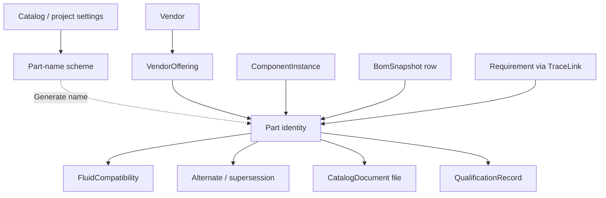
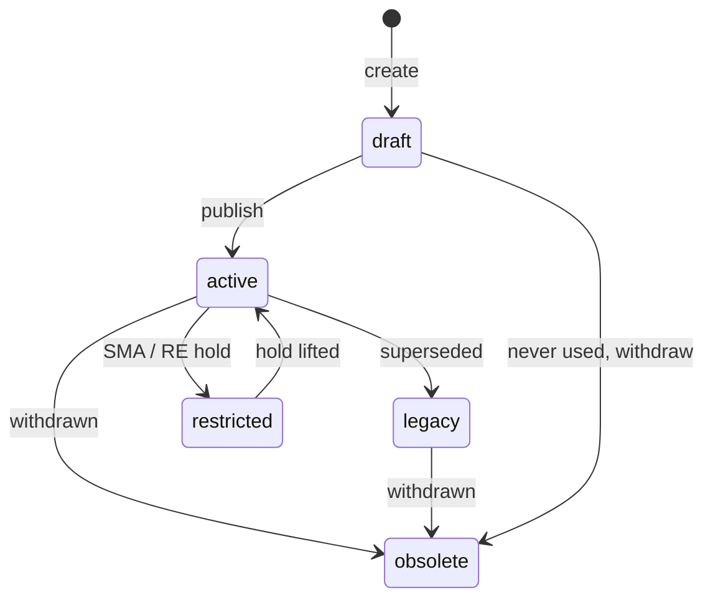

# Part Catalog Concept

Status: decisions locked (2026-08-21). Not implemented.
Audience: product, propulsion, systems, supply chain, and anyone who will live in this page daily.

This document describes a fully featured Parts Catalog for FSDP: what it is, how it sits in the digital thread, the object model, the screens, the rules, and a phased path from the current MVP form to that product.

It is written against the current codebase (`parts` table, `/parts` page, P&ID placement, BoM readiness, change impact) and against Epic 3 in [requirements.md](requirements.md). Locked product decisions are in [§16](#16-locked-decisions).

---

## 1. Thesis

The catalog is the **organizational library of hardware that may be used on fluid systems**. It is not a project BoM, not a vendor website scrape, and not a spreadsheet of part numbers.

A catalog part is an engineering identity: “this is the solenoid we use on GHe press lines.” A P&ID tag (`V-1`) is a *use* of that identity. A BoM row is a *rolled-up use*. Qualification, restrictions, and alternates live on the identity so every diagram, snapshot, and review sees the same truth.

If the catalog is weak, the rest of FSDP cannot keep its promises:

- P&ID placement becomes “type a description on a glyph.”
- BoMs cannot be procured.
- Change impact has nothing real to walk.
- Reuse (a stated product goal: +40% design reuse) never happens.

The catalog should make the fastest correct choice obvious, and the wrong choice hard.

---

## 2. What exists today

Honest baseline, so the concept is a delta, not a rewrite fantasy.

| Area | Current behavior |
|---|---|
| Scope | Single org-wide `parts` table. Not project-scoped. |
| Identity | Unique `part_number`, optional `revision` string, free-text `part_type`, `source_type` default `internal`. |
| Engineering data | Description, manufacturer, material, pressure rating, Tmin/Tmax, Cv, mass, JSON `dimensions` / `metadata`. Tmin/Tmax, Cv, mass, dimensions, source type, and revision are **not on the UI**. |
| Lifecycle | `qualification_status`: unqualified / qualified / preferred / legacy / restricted. `certification_status`: unreviewed / in_review / certified / rejected. Two independent dropdowns, no workflow, no evidence. |
| CRUD | One page: form + table. Add / update selected / delete selected. |
| Search | None. API can filter by type, material, manufacturer, qualification, min pressure; UI does not. |
| Placement | Diagrams page: pick a catalog part, pick a symbol node, type a tag, Place. No type matching, no line-condition check. |
| Where-used | Only via Reviews → change impact (component count + BoM snapshots). Not on the catalog page. |
| Delete | Blocked with 409 if the part is placed. Error text mentions obsolete; there is **no obsolete status**. |
| Readiness | BoM procurement check flags not-qualified/preferred, missing pressure, missing material. |
| Documents | None. |
| Alternates | None. |
| Vendors | Manufacturer is a string on the part. |
| Seed | Five Amphora demo parts (`AMPH-FL-001` … `AMPH-PT-001`). |

The current page is a **data-entry stub**. The data model already hints at a richer catalog (source type, ratings, Cv, mass, metadata JSON). This concept fills that in without throwing the table away.

---

## 3. Jobs to be done

### Propulsion / fluid engineer

- Find a part that is legal for this fluid, MEOP, temperature, and connection in under 30 seconds.
- Place it on a P&ID node and see tag + part name + qualification on the canvas.
- See whether the house-preferred part already exists before inventing a new one.
- When the preferred part is long-lead or restricted, pick a ranked alternate that still fits.

### Systems / responsible engineer

- Know which diagrams and released BoMs use a part before changing its rating or status.
- Restrict or obsolete a part and have every in-progress design light up.
- Trace a requirement (“all wetted parts 316L, oxygen-compatible”) to catalog identities, not just instances.

### Supply chain

- Export a buyable list: internal P/N, manufacturer P/N, vendor, lead time, qualification, missing certs.
- See which parts are preferred vs one-off.
- Flag long-lead and single-source items before a BoM is released.

### Safety / SMA

- Treat “preferred / qualified / restricted” as controlled data, not a dropdown anyone can flip.
- Attach the evidence that made a part qualified (test report, CoC, compatibility memo).
- Warn on restricted parts; record a reason. Do not silently place them as if they were preferred.

---

## 4. Design principles

1. **One identity, many uses.** Catalog part ≠ diagram component ≠ serial number. Do not collapse these.
2. **Org-wide library, project-filtered views.** The catalog is shared. A project may later have an approved-parts list (AVL); it does not own the parts. Part names are unique across the whole catalog, not per project.
3. **Status is earned.** New parts default to `unqualified` / `unreviewed`. Preferred and certified are explicit promotions with an actor.
4. **Obsolete, don’t delete.** Once a part has been placed or appeared on a released BoM, it stays in the historical record.
5. **The user decides what a part is.** A part is any catalog identity the engineer needs: valve, fitting, hose, fastener, GSE cart, make-to-print body, anything. The platform does not restrict the catalog to P&ID palette hardware. Type is a user-managed label, not a closed enum.
6. **Selection is contextual.** The picker on a P&ID can filter by an *optional* symbol mapping and by the connected line’s fluid / P / T. The browse page is for library work. Filters never hide the rest of the library behind a hard lock.
7. **Completeness is visible.** A part can exist as a stub; procurement readiness and placement **warnings** say what is missing. Do not block create on every field. Do not hard-block placement for rating/fluid mismatch.
8. **No silent engineering values.** Empty pressure rating is “unrated,” never `0`.
9. **Warn, don’t block, on engineering mismatch.** Line MEOP above part rating, unknown fluid compatibility, draft/unqualified status: warn on place and on BoM. The engineer keeps control.
10. **Keep the MVP thread intact.** Placement, BoM roll-up, readiness, and change impact keep using `part_id`. New objects hang off `Part`; they do not replace it.

---

## 5. Core object model

### 5.1 `Part` — the identity

Stable across revisions of datasheets.

| Field | Role |
|---|---|
| `part_number` | **Part name.** Unique across the entire catalog (all projects). Non-blank. Typed by the user or filled by **Generate**. Format is not enforced. |
| `description` | Noun-first, engineering English. “NC solenoid valve, 1/4 in, 24 VDC.” Need not be unique. |
| `part_type` | User-defined type label. Suggested list from settings; users can add a new type at create time. Not limited to P&ID symbols. |
| `subtype` | Optional finer label, also user-defined. |
| `source_type` | `internal` (house standard) · `vendor` (bought to MPN) · `custom` (make-to-print). |
| `lifecycle_status` | `draft` · `active` · `legacy` · `restricted` · `obsolete`. Orthogonal to qualification. |
| `preferred` | Boolean flag. Not unique. Many preferred parts may coexist. |
| `pid_symbol` | Optional. If set, the Diagrams picker can rank this part when that symbol is selected. Blank is fine. |
| `owner` | Responsible engineer (user). |
| `notes` | Free text; not a substitute for structured fields. |

`qualification_status` today mixes lifecycle, preference, and qualification. Split it:

| Axis | Values | Who changes it |
|---|---|---|
| Lifecycle | draft, active, legacy, restricted, obsolete | Engineer sets draft/active; restricted/obsolete require admin or RE |
| Qualification | unqualified, in_qualification, qualified, disqualified | Promotion to qualified requires evidence record |
| Preference | preferred flag | Admin / catalog owner |
| Certification | unreviewed, in_review, certified, rejected, expired | Evidence-backed; can expire |

Migration: map current `preferred` → lifecycle `active` + `preferred=true` + qualification `qualified`. Map `legacy` / `restricted` onto lifecycle. Map `unqualified` as-is. Keep a read-only compatibility field or dual-write during transition so existing BoM readiness does not break.

### 5.2 Part name scheme (Settings)

The identifying field is the **part name** (`part_number` in the API). It must be unique globally. Users may type any unique name. They may also press **Generate** next to the field.

Generate uses a scheme stored in Settings (the existing `/settings` page already has a “Project Configuration” placeholder). Catalog numbering is org-wide because names are global; a project may override the prefix so generated names stay unique across programs.

| Setting | Scope | Example |
|---|---|---|
| Template | Org (catalog settings) | `{prefix}-{type}-{seq}` |
| Default prefix | Org | `AMPH` |
| Sequence padding | Org | `3` → `001` |
| Type codes | Org, one per user-defined part type | `valve` → `SV`, `fitting` → `FT` |
| Project prefix | Optional per project | `HV1` instead of `AMPH` when that project is selected |

**Generate behavior**

1. Resolve prefix (project override if the current project has one, else org default).
2. Resolve type code from the part type just chosen; if none, use `XX` or omit `{type}` per template.
3. Allocate the next sequence for that prefix (atomic, catalog-wide) so two users cannot mint the same name.
4. Fill the field. The user can edit it before save.
5. On save, uniqueness is checked across all parts. Collision → 409, Generate again.

The scheme is **not a format validator**. Manually entered names such as a vendor MPN used as the internal name are valid as long as they are unique.

Admins edit the template, prefixes, and type-code table on Settings. Engineers can add a new part type from the create form; that type appears in Settings for a code to be assigned later. Until a code exists, Generate still works (prefix + sequence, or `XX`).

### 5.3 `revision` string (no revision table in v1)

Keep today’s single `revision` field on `Part` (e.g. `A`, `B`). BoM snapshot rows copy that string when generated. There is **no** `PartRevision` child table in this concept’s first delivery. Datasheet history is the uploaded files plus the change log.

### 5.4 `Vendor` and `VendorOffering`

Manufacturer is not a string forever.

- **Vendor:** name, code, website, quality status (`unreviewed`, `approved`, `conditional`, `disapproved`), notes.
- **Offering:** links a catalog part to a vendor: manufacturer P/N, list price, currency, typical lead time (days), MOQ, country of origin, datasheet URL, `is_primary`.

One internal part can have several offerings (second source). One offering is primary for procurement exports.

Custom/make-to-print parts may have no offering.

### 5.5 `FluidCompatibility`

First-class, because it is the main selection constraint in this domain.

Per part, a row per fluid (or fluid family):

- Fluid: `GHe`, `GN2`, `GOX`, `LOX`, `LCH4`, `RP-1`, `IPA`, `water`, `hydraulic`, … (controlled list, extensible).
- Rating: `compatible` · `compatible_with_controls` · `incompatible` · `unknown`.
- Notes: e.g. “oxygen-cleaned only,” “PTFE seat not for IPA.”

Unknown is allowed; it produces a **warning** on placement and in BoM readiness. Never a hard block.

### 5.6 Alternates and supersession

Directed links between parts:

| Link type | Meaning |
|---|---|
| `alternate` | Form-fit-function equivalent. Ranked (`priority`). |
| `similar` | Same type, not guaranteed FFF. Shown as “also consider.” |
| `supersedes` | `AMPH-SV-002` replaces `AMPH-SV-001`. Old part becomes legacy/obsolete. |

Alternate ranking should prefer: preferred → qualified → active → unrestricted, then better lead time.

### 5.7 `QualificationRecord` and `CatalogDocument` (files in v1)

Documents include **file upload in v1**, not URL-only.

- `CatalogDocument`: title, kind (datasheet, drawing, CAD, CoC, test report, memo, photo, other), original filename, content type, size, uploaded_by, uploaded_at, optional revision label.
- Bytes stored on the application server (disk volume beside the database). Download is an authenticated GET (same cookie session as BoM CSV).
- Optional URL in addition to a file, for vendor pages.
- Size and type limits (PDF, PNG, JPG, STEP/STP, ZIP, XLSX, DOCX; tens of MB). No CAD parsing — the file is an attachment.
- Qualification record: points at documents, states the claim (“qualified for GHe, 350 bar, −40 to 60 °C”), status, expires_at, approved_by.

Certification status on the part is a roll-up of the latest qualification/cert records, not a free dropdown with no evidence.

### 5.8 Project approved-parts list (AVL) — later

After the shared library is in daily use. Not v1. Until then any **non-obsolete** catalog part is placeable, with warnings for draft / unqualified / restricted / rating / fluid.

---

## 6. Classification — user-defined types

A part is whatever the user says it is. The catalog does not decide that fittings are “later” or that only P&ID glyphs count. Valves, AN adapters, flex hoses, fasteners, heaters, GSE, make-to-print bodies, and unnamed one-offs all belong here if the engineer catalogs them.

**`part_type` is a user-managed vocabulary**, not a closed enum:

- Settings ships with a starter list (valve, check valve, regulator, relief, sensor, filter, pump, fitting, hose, tank, …) so Generate codes and filters have something to work with.
- Create-part accepts a new type string. That type is added to the org list.
- Subtype is the same pattern: free label, remembered for next time.
- Optional `pid_symbol` on a part (or on a type in Settings) tells the Diagrams picker “rank these when the user selected a valve glyph.” It is a convenience, not a permission. Any part may be placed on any symbol; mismatch is a warning.

Canvas-only decorations (notes, section boxes, untyped junctions) still do not need a catalog row. That is a diagram concern, not a ban on cataloging fittings.

---

## 7. Engineering attributes

### 7.1 Common (every part)

- Body / wetted material (today’s `material` becomes wetted; add `body_material` if they differ).
- Seal / seat material (type-specific but common enough to promote).
- Pressure rating (MAWP, bar). Optional proof / burst later.
- Temperature min / max (°C).
- Mass (kg).
- End connections: size + standard per port, named however the user needs (`in`, `out`, `vent`, or custom).
- Envelope: JSON/structured L×W×H or diameter × length (already `dimensions`).
- Cleanliness class: `as_received` · `visibly_clean` · `precision_clean` · `oxygen_clean`.
- Cv / Kv when the user fills them. Not required by type.

### 7.2 Optional attribute templates (`attributes` JSON)

A free JSON map on the part. The backend does **not** reject unknown keys. Settings may attach an optional field template to a type (fail position, set pressure, micron rating, …). Templates are hints in the form — extra fields always allowed. A type with no template is still a valid part.

Starter templates (users can ignore or edit in Settings):

**Valve / check / solenoid** — fail position, actuation, voltage / pneumatic pressure, leakage class, cycle life.

**Regulator** — sensing, outlet range, setpoint, Cv, relief on body.

**Relief / burst disc** — set / burst pressure, crack / full-lift, reseat, capacity, vent to.

**Sensor** — measured quantity, range, units, accuracy, output.

**Filter** — micron rating, collapse pressure, replaceable element.

**Tank / COPV** — volume, MEOP / proof, fluid service.

Keep this in `Part.metadata_` or a dedicated `attributes` column. Do not invent a table per type.

### 7.3 Completeness score

A derived 0–100 used in the table and picker, not stored as gospel:

- Identity + type + description: required (else you cannot create).
- Material, pressure, temperature: needed for placement warnings and BoM readiness.
- At least one fluid compatibility row: needed for contextual pick.
- Connection spec: needed for FFF alternates.
- Primary vendor offering: needed to call a BoM “procurement-ready.”
- Qualification evidence: needed for preferred / certified.

The BoM readiness service grows from the three current checks to this list, with issue **codes and severity**. Rating/fluid/draft/unqualified mismatches are **warnings** (shown, do not fail `ready` by themselves). Missing identity on a BoM row, obsolete parts, and unresolved (no catalog part) stay blocking for “procurement-ready.”

---

## 8. Lifecycle, qualification, and who can click what

**Create:** engineer or admin. Defaults: lifecycle `draft`, qualification `unqualified`, certification `unreviewed`, `preferred=false`.

**Publish to active:** engineer. Means “this name is real.” Placement does not require active: drafts and unqualified parts **may be placed**, with warnings.

**Preferred:** catalog owner / admin. Implies active + qualified. Unsetting preferred does not unqualified the part. Preferred is not unique.

**Restricted:** SMA or admin. Still visible and placeable; warn and ask for a reason stored on the component instance (`properties.restriction_waiver`). BoM readiness flags it as a warning.

**Obsolete:** cannot place on **new** components. Existing placements remain; where-used and impact still resolve. Delete is allowed only for `draft` parts with zero placements and zero BoM rows (including historical).

**Qualification promotion:** requires at least one `QualificationRecord` in `approved` with a document. Demotion to `disqualified` records a reason and immediately fails readiness.

Viewers can read the catalog. They cannot place, edit, or change status.

---

## 9. Digital thread: how the catalog is used

### 9.1 P&ID placement (the primary write path)

Current flow stays, with optional ranking — never a hard type lock:

1. Select a symbol node (or drop a symbol, then assign).
2. Open **Assign part**. Picker opens with search, the full library, and optional chips:
   - type matches the symbol’s optional mapping (toggle off to see everything)
   - preferred, qualified, compatible with this line’s fluid, rating ≥ line pressure
   - include drafts / legacy
3. **Warn, don’t hide or block:** e.g. “rating 200 bar < line 240 bar,” “draft,” “unqualified,” “fluid unknown.”
4. Confirm → `ComponentInstance` with `part_id`, tag auto-suggested if empty. Draft and unqualified are allowed.
5. Canvas badge: tag, part name, qualification tint (preferred green, unqualified amber, restricted red).

Unassigned symbols remain legal. BoM readiness already complains (“No catalog part is linked”). That is the correct pressure: don’t force a P/N on a concept sketch.

Replacing a part on a tag is a first-class action (not delete + re-place): keeps the tag, updates `part_id`, records a change event, invalidates draft BoMs with a banner (“diagram changed since snapshot”).

### 9.2 Where-used (the primary read path from the catalog)

On every part detail page:

- Component instances: project, system, diagram, tag, quantity.
- Draft vs released BoM snapshots that contain the P/N.
- Trace links (requirements pointing at this part or at instances of it).
- Alternates and “superseded by.”

This is the same data change-impact already computes; the catalog should *show* it without a trip to Reviews.

### 9.3 BoM and procurement

Snapshot rows already copy `part_number`, description, material, qualification. Extend the row payload (additive JSON) with:

- revision pinned
- manufacturer + MPN (primary offering)
- lead time, unit cost if present
- lifecycle status
- readiness issue codes

Released BoMs freeze that copy. Catalog edits after release do not mutate the snapshot; readiness on a released BoM is a historical statement unless the user regenerates.

### 9.4 Requirements

Allow trace links `requirement → part` (library-level: “this requirement constrains all uses of AMPH-SV-001”) in addition to `requirement → component` (instance-level: “V-1 on this diagram”).

Impact analysis already keys off object type; adding `part` as a trace target is a small extension.

### 9.5 Change impact

When a part’s rating, material, compatibility, or status changes:

- List affected tags and diagrams (today).
- List released BoMs that now disagree with the live catalog (new).
- If restricted/obsolete: list in-progress diagrams still placing it (new).

---

## 10. Screens

Replace the current two-panel “form + table” with three surfaces. Same route `/parts` as the hub; detail as `/parts/:partId`.

### 10.1 Library (browse)

A working catalog, not a dump.

- Full-width table: name, description, type/subtype, manufacturer, material, rating, qualification, lifecycle, completeness, preferred star.
- Facets / filters: type, subtype, qualification, lifecycle, material, fluid compatibility, manufacturer, “incomplete,” “used in current project.”
- Search: P/N, description, MPN, manufacturer (and later full text in notes/docs titles).
- Saved views: *Preferred valves*, *Unqualified in use*, *Oxygen service*, *My drafts*.
- Bulk: none in v1 except export CSV of the filtered set.
- Primary action: **New part**. Row click opens detail. “Place on open diagram” when a diagram is in context.

Empty state: explain that this is the org library; link to seed/demo; don’t show the old VALVE-001 placeholder as if it were a real part.

### 10.2 Part detail

Single-part workspace. Tabs, not one infinite form:

1. **Overview** — identity, status chips, completeness, preferred, owner, description, type, source.
2. **Ratings & interfaces** — P/T, materials, connections/ports, envelope, mass, cleanliness, type-specific attributes.
3. **Fluids** — compatibility matrix editor.
4. **Vendors** — offerings table; pick primary.
5. **Qualification** — records + documents; status history.
6. **Where used** — instances, BoMs, traces.
7. **Alternates** — ranked graph, supersession.
8. **History** — change events for this part (actor, field-level later).

Header actions: Edit, Clone (Generate a new unique name, copy attributes), Place, Export datasheet summary, Obsolete (with confirm + where-used count).

Clone is how reuse actually happens: “same valve, different voltage” should not start from a blank form.

### 10.3 Create / edit

Drawer or full page, two-step:

1. Type (existing or new) + optional subtype + **part name** + description + source. That creates a `draft`.
2. Ratings, fluids, vendor, files — skippable; completeness shows the holes.

**Part name field:** text input plus a **Generate** control that fills the next name from the Settings scheme (see §5.2). The user can type a unique name instead. Duplicate names are rejected globally.

Do not put qualification/certification on the create form. Those are promotions on the detail page. This is the fix for the old “every new part is preferred/certified” bug, structurally, not just as a default.

Attach files on create or immediately on the detail **Documents** tab.

### 10.4 Contextual picker (embedded on Diagrams)

Modal. Not the full library.

- Search over the whole library. Optional type chip from the selected symbol; user can clear it.
- Ranked results: preferred first, then qualified, then by rating margin vs line pressure. Drafts included, marked.
- One-line why: “Preferred · 350 bar ≥ 240 bar line · GHe compatible” or “Warning: 200 bar < 240 bar line.”
- Footer: “Create new part” → create flow (type pre-filled if a chip was on), return to picker.

### 10.5 Compare

Select 2–3 rows in the library → Compare. Side-by-side: ratings, materials, fluids, Cv, connections, lead time, qualification. Used for alternate decisions. Phase 2.

### 10.6 Settings (existing `/settings`)

Replace the “Project Configuration” placeholder with:

- **Catalog numbering:** template, default prefix, sequence padding, type → code table, next-sequence preview.
- **Project prefix:** when a project is selected, optional override used by Generate (names remain globally unique).
- **Part types:** list of user-defined types, optional default `pid_symbol`, optional attribute template.
- Accounts (already there).

---

## 11. Rules (product, not just validation)

| Rule | On create/edit | On place | On BoM |
|---|---|---|---|
| Blank name / type / description | Block | — | — |
| Duplicate part name (global) | Block | — | — |
| Pressure `""` | Store null (unrated), never 0 | Warn | Warn `unrated` |
| Lifecycle draft | Allowed | Warn | Warn |
| Unqualified | Allowed | Warn | Warn |
| Restricted | Allowed | Warn + reason | Warn |
| Obsolete | — | Block new places | Issue (blocking) |
| Type vs symbol mismatch | — | Warn | Warn |
| Line pressure > part rating | — | Warn | Warn |
| Line fluid incompatible / unknown | Allowed | Warn | Warn |
| No primary vendor | Allowed | — | Warn `no_vendor` |
| No catalog part on component | — | — | Issue (blocking) |
| Delete | Only draft + unused | — | — |
| Flip to preferred | Must be active + qualified | — | — |

Viewer role: read-only everywhere.

---

## 12. Search and reuse

Library search is the Epic 11 slice that actually gets used.

**Query:** tokenized over P/N, description, manufacturer, MPN, tag-in-where-used (later).

**Filters:** type, fluid, min pressure, material, qualification, lifecycle, preferred, used-in-project.

**Ranking:** exact P/N, then preferred, then qualified, then completeness, then recent use in this project (reuse).

Global header search (today a non-functional box) should hit parts first, then requirements keys, then diagram tags. Out of scope for the catalog epic except: part results must be good enough to deep-link to `/parts/:id`.

---

## 13. Import, export, documents

- **Documents (v1):** upload files on the part (see §5.7). List, download, replace, delete. Optional vendor URL alongside a file.
- **Export CSV/XLSX** of the current library filter: all engineering fields + primary vendor + status.
- **Import CSV** for initial catalog stand-up (admin). Dry-run with row errors; no silent overwrite of names that are in use. Phase 2.
- **Clone + import** is how vendor catalogs enter: not a live punch-out to Swagelok.
- CAD/STEP **parsing** stays deferred; attaching a STEP file is in v1.

---

## 14. Permissions

| Action | Viewer | Engineer | Admin |
|---|---|---|---|
| Browse / search / where-used | yes | yes | yes |
| Place on diagram | no | yes | yes |
| Generate part name | no | yes | yes |
| Create draft, edit draft/active technical fields | no | yes | yes |
| Publish draft → active | no | yes | yes |
| Set preferred | no | no | yes |
| Restrict / obsolete | no | no* | yes |
| Approve qualification record | no | no | yes |
| Import CSV, manage vendors, edit name scheme | no | no | yes |
| Delete unused draft | no | own drafts | yes |

\*Responsible-engineer restrict/obsolete can be added when that role exists. Until then, admin only.

All mutations already go through `record_change`; field-level diffs are a later improvement but the actor is required from day one of any catalog work.

---

## 15. Explicitly out of scope (for this concept)

These belong to later epics or other systems. The catalog should have seams, not implementations:

- ERP / purchasing execution, POs, receiving, serialised inventory.
- Full CAD vault, automatic STEP parsing, geometry-based envelope clash. Attaching CAD files is in scope; interpreting them is not.
- Live vendor API punch-out.
- Lot/serial as-built (that is Manufacturing, hanging off `ComponentInstance`, not `Part`).
- Automatic FFF from geometry; alternates are declared.
- Multi-org / multi-tenant catalog sharing.
- AI “recommend a part” beyond ranked filters (PRD deferred AI).
- Configuration branching of the catalog itself.

---

## 16. Locked decisions

Recorded 2026-08-21.

1. **Place drafts / unqualified parts?** Yes, with warnings. Obsolete still cannot be newly placed.
2. **Line pressure above part rating?** Warn only — on place and on BoM. Never hard-block.
3. **Uniqueness:** the **part name** is unique globally (whole catalog, all projects). `preferred` is a flag, not a uniqueness constraint.
4. **Name format is not enforced.** A **Generate** button fills the name field from a scheme defined on the **Settings** page (org template + optional per-project prefix). Users may type any unique name.
5. **Documents:** file upload in v1 (server disk + authenticated download). URLs optional extra.
6. **Project AVL:** after the shared library is working. Not v1.
7. **Part revision table:** no. Keep the existing `revision` string.
8. **What is a part?** Up to the user. No platform rule that fittings/hoses are out of scope or that types must match the P&ID palette. Types are user-defined; optional symbol mapping is only a picker convenience.

---

## 17. Phased delivery

Each phase should be usable alone. No big-bang rewrite of `/parts`.

### Phase A — Honest library + identity

- Show all fields the API already has: source type, revision, Tmin/Tmax, Cv, mass.
- Part name unique globally; create/edit field labeled accordingly.
- **Generate** name button + Settings scheme (template, prefix, type codes, optional project prefix). Fill the existing `/settings` “Project Configuration” placeholder.
- User-defined types (starter list + add-on-create). Optional `pid_symbol` mapping in Settings.
- Filters + search on the library table.
- Completeness hints; empty rating stays unrated.
- Lifecycle: add `obsolete`; stop overloading qualification with preferred/legacy.
- Where-used panel (reuse change-impact API).
- Obsolete instead of delete-when-placed.
- **File upload** on the part (documents tab).

### Phase B — Contextual selection

- Assign-part modal on the canvas; full library searchable; optional type chip.
- Warn-only for draft, unqualified, rating vs line pressure, fluid compatibility.
- Canvas badge: part name + qualification tint; click through to `/parts/:id`.
- Replace-part on an existing tag.
- Readiness issue codes with warning vs blocking severity.
- Requirement → part trace links.

### Phase C — Vendors, qualification evidence, alternates

- Vendor + offering objects; primary source on BoM export.
- Qualification records pointing at uploaded files; preferred/certified require evidence.
- Alternate / supersession links; picker “show alternates.”
- Clone part (Generate a new unique name).
- CSV export of library; admin CSV import.
- Compare 2–3 parts.

### Phase D — Control plane (later)

- Project AVL.
- Field-level audit on status changes.
- Expired certs, long-lead flags, single-source warnings.
- Saved views, header global search hitting parts.
- `PartRevision` history only if a later decision reverses §16.7.

---

## 18. Success criteria (how we know this worked)

- An engineer can find and place a preferred part for a known line (fluid + pressure) in **under 30 seconds**, including from a draft/unqualified row if that is what they choose.
- Generate produces a unique name from Settings without blocking a typed name.
- Any kind of hardware can be cataloged; a fitting is a first-class part.
- Rating/fluid mismatches **warn** and never prevent placing or saving.
- Restricting or obsoleting a part shows **every live tag and released snapshot** on the part page.
- Datasheets and CoCs can be uploaded and downloaded while signed in.
- Zero catalog deletes of parts that ever appeared on a released BoM.

---

## 19. Remaining review

Decisions in §16 are locked. Still useful to confirm:

1. **Thesis:** org-wide identity + uses on diagrams — still agreed?
2. **Status split:** lifecycle × qualification × preferred × certification — too many axes, or the right untangle?
3. **Name scheme tokens:** is `{prefix}-{type}-{seq}` the right default template to put on Settings, or do you already have an Amphora scheme to paste in?

Phase A is the next implementation slice: unique names, Generate + Settings, user-defined types, file upload, honest library.
