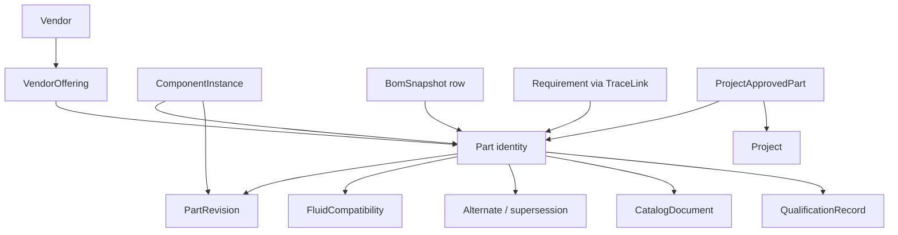
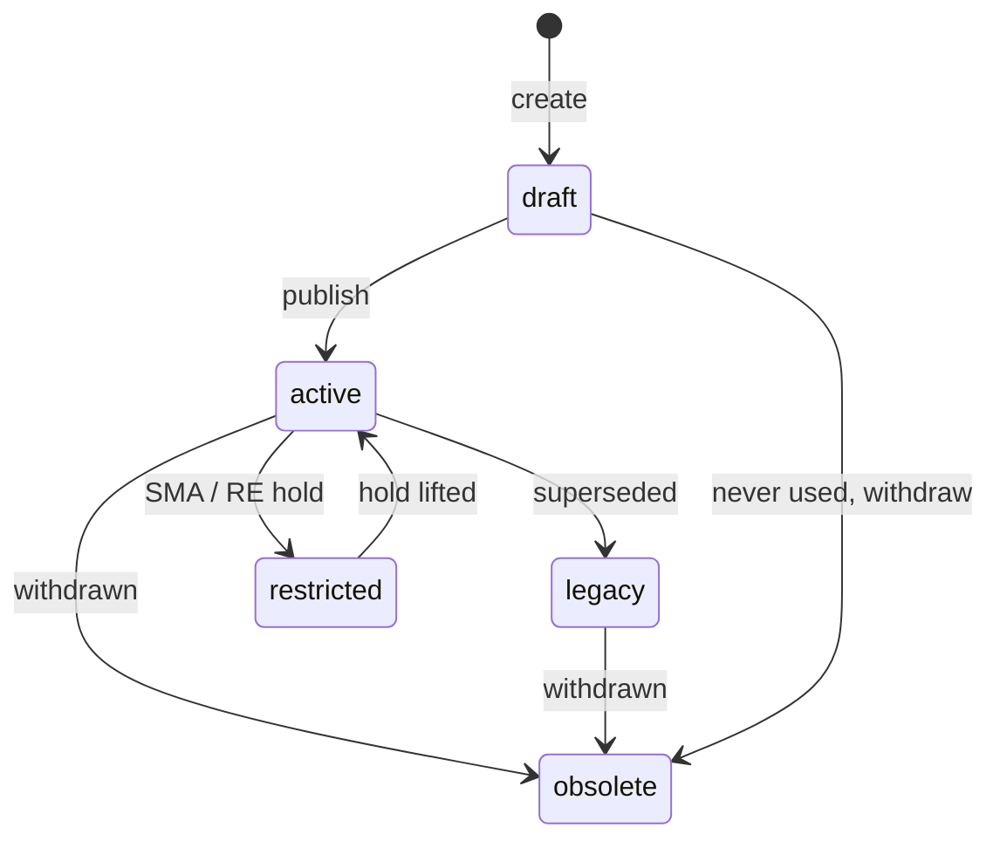

# Part Catalog Concept

Status: proposed for review. Not implemented.
Audience: product, propulsion, systems, supply chain, and anyone who will live in this page daily.

This document describes a fully featured Parts Catalog for FSDP: what it is, how it sits in the digital thread, the object model, the screens, the rules, and a phased path from the current MVP form to that product.

It is written against the current codebase (`parts` table, `/parts` page, P&ID placement, BoM readiness, change impact) and against Epic 3 in [requirements.md](requirements.md).

---

## 1. Thesis

The catalog is the **organizational library of hardware that may be used on fluid systems**. It is not a project BoM, not a vendor website scrape, and not a spreadsheet of part numbers.

A catalog part is an engineering identity: “this is the solenoid we use on GHe press lines.” A P&ID tag (`V-1`) is a *use* of that identity. A BoM row is a *rolled-up use*. Qualification, restrictions, and alternates live on the identity so every diagram, snapshot, and review sees the same truth.

If the catalog is weak, the rest of FSDP cannot keep its promises:

- P&ID placement becomes “type a description on a glyph.”
- BoMs cannot be procured.
- Change impact has nothing real to walk.
- Reuse (a stated product goal: +40% design reuse) never happens.

The catalog should make the fastest correct choice obvious, and the wrong choice hard.

---

## 2. What exists today

Honest baseline, so the concept is a delta, not a rewrite fantasy.

| Area | Current behavior |
|---|---|
| Scope | Single org-wide `parts` table. Not project-scoped. |
| Identity | Unique `part_number`, optional `revision` string, free-text `part_type`, `source_type` default `internal`. |
| Engineering data | Description, manufacturer, material, pressure rating, Tmin/Tmax, Cv, mass, JSON `dimensions` / `metadata`. Tmin/Tmax, Cv, mass, dimensions, source type, and revision are **not on the UI**. |
| Lifecycle | `qualification_status`: unqualified / qualified / preferred / legacy / restricted. `certification_status`: unreviewed / in_review / certified / rejected. Two independent dropdowns, no workflow, no evidence. |
| CRUD | One page: form + table. Add / update selected / delete selected. |
| Search | None. API can filter by type, material, manufacturer, qualification, min pressure; UI does not. |
| Placement | Diagrams page: pick a catalog part, pick a symbol node, type a tag, Place. No type matching, no line-condition check. |
| Where-used | Only via Reviews → change impact (component count + BoM snapshots). Not on the catalog page. |
| Delete | Blocked with 409 if the part is placed. Error text mentions obsolete; there is **no obsolete status**. |
| Readiness | BoM procurement check flags not-qualified/preferred, missing pressure, missing material. |
| Documents | None. |
| Alternates | None. |
| Vendors | Manufacturer is a string on the part. |
| Seed | Five Amphora demo parts (`AMPH-FL-001` … `AMPH-PT-001`). |

The current page is a **data-entry stub**. The data model already hints at a richer catalog (source type, ratings, Cv, mass, metadata JSON). This concept fills that in without throwing the table away.

---

## 3. Jobs to be done

### Propulsion / fluid engineer

- Find a part that is legal for this fluid, MEOP, temperature, and connection in under 30 seconds.
- Place it on a P&ID node and see tag + P/N + qualification on the canvas.
- See whether the house-preferred part already exists before inventing a new one.
- When the preferred part is long-lead or restricted, pick a ranked alternate that still fits.

### Systems / responsible engineer

- Know which diagrams and released BoMs use a part before changing its rating or status.
- Restrict or obsolete a part and have every in-progress design light up.
- Trace a requirement (“all wetted parts 316L, oxygen-compatible”) to catalog identities, not just instances.

### Supply chain

- Export a buyable list: internal P/N, manufacturer P/N, vendor, lead time, qualification, missing certs.
- See which parts are preferred vs one-off.
- Flag long-lead and single-source items before a BoM is released.

### Safety / SMA

- Treat “preferred / qualified / restricted” as controlled data, not a dropdown anyone can flip.
- Attach the evidence that made a part qualified (test report, CoC, compatibility memo).
- Refuse placement of restricted parts on flight systems without an explicit deviation.

---

## 4. Design principles

1. **One identity, many uses.** Catalog part ≠ diagram component ≠ serial number. Do not collapse these.
2. **Org-wide library, project-filtered views.** The catalog is shared. A project may later have an approved-parts list (AVL); it does not own the parts.
3. **Status is earned.** New parts default to `unqualified` / `unreviewed`. Preferred and certified are explicit promotions with an actor.
4. **Obsolete, don’t delete.** Once a part has been placed or appeared on a released BoM, it stays in the historical record.
5. **Type-aware, not generic PLM.** A relief valve and a pressure transducer do not share the same form. Common fields plus a type-specific payload.
6. **Selection is contextual.** The picker on a P&ID knows the symbol type and the connected line’s fluid / P / T. The browse page is for library work.
7. **Completeness is visible.** A part can exist as a stub; procurement readiness and placement warnings say what is missing. Do not block create on every field.
8. **No silent engineering values.** Empty pressure rating is “unrated,” never `0`.
9. **Match the P&ID symbol language.** `part_type` is a controlled vocabulary aligned with palette symbols (`valve`, `relief_valve`, `sensor`, …), with a subtype for ball / solenoid / burst disc / PT / TC.
10. **Keep the MVP thread intact.** Placement, BoM roll-up, readiness, and change impact keep using `part_id`. New objects hang off `Part`; they do not replace it.

---

## 5. Core object model

### 5.1 `Part` — the identity

Stable across revisions of datasheets.

| Field | Role |
|---|---|
| `part_number` | Unique internal P/N. Human-assigned; validated non-blank. Optional Amphora scheme later (e.g. `AMPH-SV-001`). |
| `description` | Noun-first, engineering English. “NC solenoid valve, 1/4 in, 24 VDC.” |
| `part_type` | Controlled type matching P&ID symbols. |
| `subtype` | Finer class: `solenoid`, `ball`, `check`, `burst_disc`, `pressure_transducer`, `thermocouple`. |
| `source_type` | `internal` (house standard) · `vendor` (bought to MPN) · `custom` (make-to-print). |
| `lifecycle_status` | `draft` · `active` · `legacy` · `restricted` · `obsolete`. Orthogonal to qualification. |
| `preferred` | Boolean. At most one preferred part per (type, subtype, a defined family). Soft rule, warned not hard-blocked. |
| `owner` | Responsible engineer (user). |
| `notes` | Free text; not a substitute for structured fields. |

`qualification_status` today mixes lifecycle, preference, and qualification. Split it:

| Axis | Values | Who changes it |
|---|---|---|
| Lifecycle | draft, active, legacy, restricted, obsolete | Engineer sets draft/active; restricted/obsolete require admin or RE |
| Qualification | unqualified, in_qualification, qualified, disqualified | Promotion to qualified requires evidence record |
| Preference | preferred flag | Admin / catalog owner |
| Certification | unreviewed, in_review, certified, rejected, expired | Evidence-backed; can expire |

Migration: map current `preferred` → lifecycle `active` + `preferred=true` + qualification `qualified`. Map `legacy` / `restricted` onto lifecycle. Map `unqualified` as-is. Keep a read-only compatibility field or dual-write during transition so existing BoM readiness does not break.

### 5.2 `PartRevision`

Datasheet changes without changing the P/N.

- `revision` (e.g. `A`, `B`, `1`).
- Frozen copy of ratings and type-specific attributes at that rev.
- `effective_from` / `superseded_by`.
- Component instances and released BoM rows **pin a revision**. Editing the live catalog does not rewrite history.

Phase 1 can keep a single `revision` string on `Part` (today’s column) and introduce the child table when the first real datasheet change needs history.

### 5.3 `Vendor` and `VendorOffering`

Manufacturer is not a string forever.

- **Vendor:** name, code, website, quality status (`unreviewed`, `approved`, `conditional`, `disapproved`), notes.
- **Offering:** links a catalog part to a vendor: manufacturer P/N, list price, currency, typical lead time (days), MOQ, country of origin, datasheet URL, `is_primary`.

One internal part can have several offerings (second source). One offering is primary for procurement exports.

Custom/make-to-print parts may have no offering.

### 5.4 `FluidCompatibility`

First-class, because it is the main selection constraint in this domain.

Per part, a row per fluid (or fluid family):

- Fluid: `GHe`, `GN2`, `GOX`, `LOX`, `LCH4`, `RP-1`, `IPA`, `water`, `hydraulic`, … (controlled list, extensible).
- Rating: `compatible` · `compatible_with_controls` · `incompatible` · `unknown`.
- Notes: e.g. “oxygen-cleaned only,” “PTFE seat not for IPA.”

Unknown is allowed; it produces a warning on placement and a readiness issue, not a hard block, until SMA policy says otherwise.

### 5.5 Alternates and supersession

Directed links between parts:

| Link type | Meaning |
|---|---|
| `alternate` | Form-fit-function equivalent. Ranked (`priority`). |
| `similar` | Same type, not guaranteed FFF. Shown as “also consider.” |
| `supersedes` | `AMPH-SV-002` replaces `AMPH-SV-001`. Old part becomes legacy/obsolete. |

Alternate ranking should prefer: preferred → qualified → active → unrestricted, then better lead time.

### 5.6 `QualificationRecord` and `CatalogDocument`

- Document: datasheet, drawing, CAD (link or file), CoC template, test report, compatibility memo, oxygen-clean procedure. Metadata: title, kind, revision, URI or stored blob, uploaded_by, uploaded_at.
- Qualification record: points at documents, states the claim (“qualified for GHe, 350 bar, −40 to 60 °C”), status, expires_at, approved_by.

Certification status on the part is a roll-up of the latest qualification/cert records, not a free dropdown with no evidence.

### 5.7 `ProjectApprovedPart` (AVL) — later phase

Optional join: this project may only place parts in this list, or must warn when placing off-list. Default until then: any `active` catalog part is placeable, with warnings for unqualified / restricted / incompatible.

---

## 6. Classification (aligned with the P&ID palette)

Controlled `part_type` values. Subtypes are suggestions; the type list is the contract with the canvas.

| `part_type` | P&ID symbol | Typical subtypes |
|---|---|---|
| `valve` | valve | ball, needle, globe, solenoid, latching, manual |
| `check_valve` | check_valve | poppet, swing |
| `regulator` | regulator | dome, spring, back-pressure |
| `relief_valve` | relief_valve | spring, pilot, burst_disc |
| `sensor` | sensor | pressure, temperature, flow, level |
| `filter` | filter | sintered, etched-disc, coalescing |
| `pump` | pump | centrifugal, PD, turbopump (placeholder) |
| `fitting` | (often omitted / junction) | elbow, tee, adapter, AN, VCR, weld |
| `hose` | line-associated | flex, vacuum-jacketed |
| `orifice` | custom / valve-like | fixed, adjustable |
| `tank` | tank / source | COPV, dewar, bottle |
| `quick_disconnect` | custom | GSE, flight |
| `instrument_valve` | valve | manifold, 2-way, 3-way |
| `other` | generic component | escape hatch |

Placement rule: the picker defaults to parts whose `part_type` matches the selected symbol. The engineer can widen the filter (e.g. place a burst disc on a relief-valve symbol) with a visible “type mismatch” warning.

Junctions, notes, and section boxes are **not** catalog parts.

---

## 7. Engineering attributes

### 7.1 Common (every part)

- Body / wetted material (today’s `material` becomes wetted; add `body_material` if they differ).
- Seal / seat material (type-specific but common enough to promote).
- Pressure rating (MAWP, bar). Optional proof / burst later.
- Temperature min / max (°C).
- Mass (kg).
- End connections: size + standard per port (`1/4 AN`, `1/2 VCR`, `1/4 NPT`, `weld 12.7 mm`). Ports named to match symbol ports (`in`, `out`, `vent`, `sense`, `pilot`).
- Envelope: JSON/structured L×W×H or diameter × length (already `dimensions`).
- Cleanliness class: `as_received` · `visibly_clean` · `precision_clean` · `oxygen_clean`.
- Cv / Kv where it applies (valves, regulators, filters, orifices).

### 7.2 Type-specific payload (`attributes` JSON, schema per type)

Validated by backend per `part_type`. Unknown keys rejected. This avoids a 80-column table while staying queryable for filters that matter.

**Valve / check / solenoid**

- Fail position: NC / NO / last
- Actuation: manual, solenoid, pneumatic, motor
- Voltage / pneumatic pressure
- Leakage class
- Cycle life (optional)

**Regulator**

- Sensing: dome / spring / referenced
- Outlet range, setpoint
- Cv
- Relief on body? (bool)

**Relief / burst disc**

- Set / burst pressure
- Crack / full-lift
- Reseat
- Relieving capacity (if known)
- Direction / vent to

**Sensor**

- Measured quantity, range, units
- Accuracy
- Output: 4–20 mA, 0–10 V, digital
- Process connection

**Filter**

- Micron rating
- Collapse pressure
- Element replaceable?

**Tank / COPV**

- Volume
- MEOP / proof
- Fluid service

Keep the JSON in `Part.metadata_` / a dedicated `attributes` column. Do not invent a new database per type.

### 7.3 Completeness score

A derived 0–100 used in the table and picker, not stored as gospel:

- Identity + type + description: required (else you cannot create).
- Material, pressure, temperature: needed for placement warnings and BoM readiness.
- At least one fluid compatibility row: needed for contextual pick.
- Connection spec: needed for FFF alternates.
- Primary vendor offering: needed to call a BoM “procurement-ready.”
- Qualification evidence: needed for preferred / certified.

The BoM readiness service grows from the three current checks to this list, with issue codes (`unrated`, `no_material`, `not_qualified`, `restricted`, `obsolete`, `incompatible_fluid`, `no_vendor`, `long_lead`, `expired_cert`).

---

## 8. Lifecycle, qualification, and who can click what

**Create:** engineer or admin. Defaults: lifecycle `draft`, qualification `unqualified`, certification `unreviewed`, `preferred=false`.

**Publish to active:** engineer. Means “this P/N is real and may be placed.” Still unqualified until evidence exists.

**Preferred:** catalog owner / admin. Implies active + qualified. Unsetting preferred does not unqualified the part.

**Restricted:** SMA or admin. Still visible; placement requires a typed reason stored on the component instance (`properties.restriction_waiver`). BoM readiness always flags it.

**Obsolete:** cannot place on new components. Existing placements remain; where-used and impact still resolve. Delete is allowed only for `draft` parts with zero placements and zero BoM rows (including historical).

**Qualification promotion:** requires at least one `QualificationRecord` in `approved` with a document. Demotion to `disqualified` records a reason and immediately fails readiness.

Viewers can read the catalog. They cannot place, edit, or change status.

---

## 9. Digital thread: how the catalog is used

### 9.1 P&ID placement (the primary write path)

Current flow stays, but becomes type-aware:

1. Select a symbol node (or drop a symbol, then assign).
2. Open **Assign part** (inspector or shortcut). Picker opens pre-filtered:
   - `part_type` matches symbol
   - lifecycle in `active` (optional toggle: show legacy)
   - search box
   - chips: preferred, qualified, compatible with this line’s fluid, MEOP ≤ rating
3. Highlight mismatches rather than hiding everything: e.g. “rating 200 bar < line 240 bar.”
4. Confirm → `ComponentInstance` with `part_id`, optional `revision`, tag auto-suggested (`V-3`) if empty.
5. Canvas badge: tag, P/N, qualification tint (preferred green, unqualified amber, restricted red).

Unassigned symbols remain legal. BoM readiness already complains (“No catalog part is linked”). That is the correct pressure: don’t force a P/N on a concept sketch.

Replacing a part on a tag is a first-class action (not delete + re-place): keeps the tag, updates `part_id`, records a change event, invalidates draft BoMs with a banner (“diagram changed since snapshot”).

### 9.2 Where-used (the primary read path from the catalog)

On every part detail page:

- Component instances: project, system, diagram, tag, quantity.
- Draft vs released BoM snapshots that contain the P/N.
- Trace links (requirements pointing at this part or at instances of it).
- Alternates and “superseded by.”

This is the same data change-impact already computes; the catalog should *show* it without a trip to Reviews.

### 9.3 BoM and procurement

Snapshot rows already copy `part_number`, description, material, qualification. Extend the row payload (additive JSON) with:

- revision pinned
- manufacturer + MPN (primary offering)
- lead time, unit cost if present
- lifecycle status
- readiness issue codes

Released BoMs freeze that copy. Catalog edits after release do not mutate the snapshot; readiness on a released BoM is a historical statement unless the user regenerates.

### 9.4 Requirements

Allow trace links `requirement → part` (library-level: “this requirement constrains all uses of AMPH-SV-001”) in addition to `requirement → component` (instance-level: “V-1 on this diagram”).

Impact analysis already keys off object type; adding `part` as a trace target is a small extension.

### 9.5 Change impact

When a part’s rating, material, compatibility, or status changes:

- List affected tags and diagrams (today).
- List released BoMs that now disagree with the live catalog (new).
- If restricted/obsolete: list in-progress diagrams still placing it (new).

---

## 10. Screens

Replace the current two-panel “form + table” with three surfaces. Same route `/parts` as the hub; detail as `/parts/:partId`.

### 10.1 Library (browse)

A working catalog, not a dump.

- Full-width table: P/N, description, type/subtype, manufacturer, material, rating, qualification, lifecycle, completeness, preferred star.
- Facets / filters: type, subtype, qualification, lifecycle, material, fluid compatibility, manufacturer, “incomplete,” “used in current project.”
- Search: P/N, description, MPN, manufacturer (and later full text in notes/docs titles).
- Saved views: *Preferred valves*, *Unqualified in use*, *Oxygen service*, *My drafts*.
- Bulk: none in v1 except export CSV of the filtered set.
- Primary action: **New part**. Row click opens detail. “Place on open diagram” when a diagram is in context.

Empty state: explain that this is the org library; link to seed/demo; don’t show the old VALVE-001 placeholder as if it were a real part.

### 10.2 Part detail

Single-part workspace. Tabs, not one infinite form:

1. **Overview** — identity, status chips, completeness, preferred, owner, description, type, source.
2. **Ratings & interfaces** — P/T, materials, connections/ports, envelope, mass, cleanliness, type-specific attributes.
3. **Fluids** — compatibility matrix editor.
4. **Vendors** — offerings table; pick primary.
5. **Qualification** — records + documents; status history.
6. **Where used** — instances, BoMs, traces.
7. **Alternates** — ranked graph, supersession.
8. **History** — change events for this part (actor, field-level later).

Header actions: Edit, Clone (new P/N, copy attributes), Place, Export datasheet summary, Obsolete (with confirm + where-used count).

Clone is how reuse actually happens: “same valve, different voltage” should not start from a blank form.

### 10.3 Create / edit

Drawer or full page, two-step:

1. Type + subtype + P/N + description + source. That create a `draft`.
2. Ratings, fluids, vendor — skippable, completeness shows the holes.

Do not put qualification/certification on the create form. Those are promotions on the detail page. This is the fix for the old “every new part is preferred/certified” bug, structurally, not just as a default.

### 10.4 Contextual picker (embedded on Diagrams)

Modal. Not the full library.

- Search + type filter locked to symbol (unlockable).
- Ranked results: preferred first, then qualified, then by rating margin vs line MEOP.
- One-line why: “Preferred · 350 bar ≥ 240 bar line · GHe compatible.”
- Footer: “Create new part of this type” → create flow with type pre-filled, return to picker.

### 10.5 Compare

Select 2–3 rows in the library → Compare. Side-by-side: ratings, materials, fluids, Cv, connections, lead time, qualification. Used for alternate decisions. Phase 2.

---

## 11. Rules (product, not just validation)

| Rule | On create/edit | On place | On BoM release |
|---|---|---|---|
| Blank P/N / type / description | Block | — | — |
| Duplicate P/N | Block | — | — |
| Pressure `""` | Store null (unrated), never 0 | Warn | Issue `unrated` |
| Lifecycle draft | Allowed | Warn or block (decision: see §16) | Issue |
| Restricted | Allowed | Waiver required | Always issue |
| Obsolete | — | Block | Issue if still present |
| Type vs symbol mismatch | — | Warn | — |
| Line MEOP > part rating | — | Warn (block if project policy) | Issue |
| Line fluid incompatible | — | Warn / block if `incompatible` | Issue |
| Fluid `unknown` | Allowed | Warn | Issue |
| No primary vendor | Allowed | — | Issue `no_vendor` |
| Delete | Only draft + unused | — | — |
| Flip to preferred | Must be active + qualified | — | — |

Viewer role: read-only everywhere.

---

## 12. Search and reuse

Library search is the Epic 11 slice that actually gets used.

**Query:** tokenized over P/N, description, manufacturer, MPN, tag-in-where-used (later).

**Filters:** type, fluid, min pressure, material, qualification, lifecycle, preferred, used-in-project.

**Ranking:** exact P/N, then preferred, then qualified, then completeness, then recent use in this project (reuse).

Global header search (today a non-functional box) should hit parts first, then requirements keys, then diagram tags. Out of scope for the catalog epic except: part results must be good enough to deep-link to `/parts/:id`.

---

## 13. Import, export, documents

- **Export CSV/XLSX** of the current library filter: all engineering fields + primary vendor + status. Same columns as an extended BoM where it makes sense.
- **Import CSV** for initial catalog stand-up (admin). Dry-run with row errors; no silent overwrite of P/Ns that are in use. Phase 2.
- **Documents:** upload to object storage or attach URL. MVP can be URL-only (datasheet link) so we do not build a file service first. CAD/STEP ingestion stays deferred per the PRD; a filename + URI is enough.
- **Clone + import** is how vendor catalogs enter: not a live punch-out to Swagelok.

---

## 14. Permissions

| Action | Viewer | Engineer | Admin |
|---|---|---|---|
| Browse / search / where-used | yes | yes | yes |
| Place on diagram | no | yes | yes |
| Create draft, edit draft/active technical fields | no | yes | yes |
| Publish draft → active | no | yes | yes |
| Set preferred | no | no | yes |
| Restrict / obsolete | no | no* | yes |
| Approve qualification record | no | no | yes |
| Import CSV, manage vendors | no | no | yes |
| Delete unused draft | no | own drafts | yes |

\*Responsible-engineer restrict/obsolete can be added when that role exists. Until then, admin only.

All mutations already go through `record_change`; field-level diffs are a later improvement but the actor is required from day one of any catalog work.

---

## 15. Explicitly out of scope (for this concept)

These belong to later epics or other systems. The catalog should have seams, not implementations:

- ERP / purchasing execution, POs, receiving, serialised inventory.
- Full CAD vault, automatic STEP parsing, geometry-based envelope clash.
- Live vendor API punch-out.
- Lot/serial as-built (that is Manufacturing, hanging off `ComponentInstance`, not `Part`).
- Automatic FFF from geometry; alternates are declared.
- Multi-org / multi-tenant catalog sharing.
- AI “recommend a part” beyond ranked filters (PRD deferred AI).
- Configuration branching of the catalog itself.

---

## 16. Open questions for review

Please mark a preference on these; they change the first slice.

1. **May engineers place `draft` or `unqualified` parts?**  
   Recommendation: **yes, with warnings.** Concept sketches should not wait on SMA. Released BoMs stay blocked by readiness.

2. **Hard-block vs warn when line MEOP exceeds part rating?**  
   Recommendation: **warn on place, fail readiness on release.** Hard-block once we trust line pressures (they were TBD for a long time).

3. **One preferred part per subtype globally, or per fluid service?**  
   Recommendation: **per (type, subtype, fluid family)** when compatibility exists; otherwise per subtype. Do not over-constrain v1 — preferred is a star, not a uniqueness constraint.

4. **Internal P/N scheme:** free string vs enforced `AMPH-xx-nnn`?  
   Recommendation: **free string with optional prefix helper.** Enforcement is a policy fight; uniqueness is enough.

5. **Documents:** URL-only first, or file upload in v1?  
   Recommendation: **URL + optional local upload if the environment already has object storage; otherwise URL.**

6. **AVL (project approved list):** needed before internal daily use, or after a healthy org catalog?  
   Recommendation: **after.** One shared library, warnings for unqualified/restricted. AVL when a second vehicle program exists.

7. **Part revisions as a child table in the first slice?**  
   Recommendation: **no.** Keep today’s `revision` string; pin it onto BoM rows. Introduce `PartRevision` when the first datasheet change would otherwise smash history.

8. **Fittings and hoses in the catalog, or only “major” components?**  
   Recommendation: **types exist, but the first UI emphasizes palette-aligned hardware.** Fittings can wait so the library does not become 4,000 adapters before it has 40 valves.

---

## 17. Phased delivery

Each phase should be usable alone. No big-bang rewrite of `/parts`.

### Phase A — Make the stub honest (small, unblocks trust)

- Show all fields the API already has: source type, revision, Tmin/Tmax, Cv, mass.
- Controlled `part_type` select aligned with palette symbols.
- Filters + search on the library table (wire up existing query params).
- Completeness hints; stop treating empty rating as 0 (already partly fixed).
- Lifecycle: add `obsolete`; map UI away from overloading `qualification_status` with preferred/legacy (additive, dual-write).
- Where-used panel on the selected part (reuse change-impact API).
- Delete CTA explains obsolete; obsolete action instead of delete-when-placed.
- Placement picker filters by selected symbol type.

This phase is mostly frontend plus a few enums. Highest ratio of “feels like a catalog.”

### Phase B — Contextual selection (the digital-thread payoff)

- Assign-part modal on the canvas with ranked results.
- Line fluid / P / T vs part ratings and compatibility (compatibility table + editor).
- Canvas badge: P/N + qualification tint; click through to `/parts/:id`.
- Replace-part on an existing tag.
- Readiness issue codes expanded (`incompatible_fluid`, `obsolete`, `restricted`).
- Requirement → part trace links.

### Phase C — Vendors, documents, alternates

- Vendor + offering objects; primary source on BoM export.
- Document URLs + qualification records; preferred/certified require evidence.
- Alternate / supersession links; picker “show alternates.”
- Clone part.
- CSV export of library; admin CSV import.
- Compare 2–3 parts.

### Phase D — Control plane

- `PartRevision` history; instances pin rev.
- Project AVL.
- Field-level audit on status changes.
- Expired certs, long-lead flags, single-source warnings.
- Optional file upload.
- Saved views, header global search hitting parts.

---

## 18. Success criteria (how we know this worked)

Aligned with the PRD metrics that the catalog actually moves:

- An engineer can find and place a preferred valve for a GHe line (known MEOP + fluid) in **under 30 seconds**.
- A BoM generated from a fully assigned diagram produces a **procurement-ready** result or a **precise** issue list (no silent unqualified-as-preferred).
- Restricting or obsoleting a part shows **every live tag and released snapshot** on the part page without going to Reviews.
- Reuse: placing a part that already exists is faster than creating a look-alike (clone + search + preferred ranking).
- Zero catalog deletes of parts that ever appeared on a released BoM.

---

## 19. Suggested first review pass

When reading this, please react at three levels:

1. **Thesis:** org-wide identity + uses on diagrams, not a per-project spreadsheet. Agree / not.
2. **Split of status:** lifecycle × qualification × preferred × certification. Too many axes, or the right untangle of today’s two dropdowns?
3. **Phase A vs B:** is the next engineering week the honest library (A) or the canvas picker (B)? Recommendation is **A then B** so placement has something worth picking.

Mark decisions on the eight questions in §16. Those are the only gates needed to turn this into implementation tasks.
