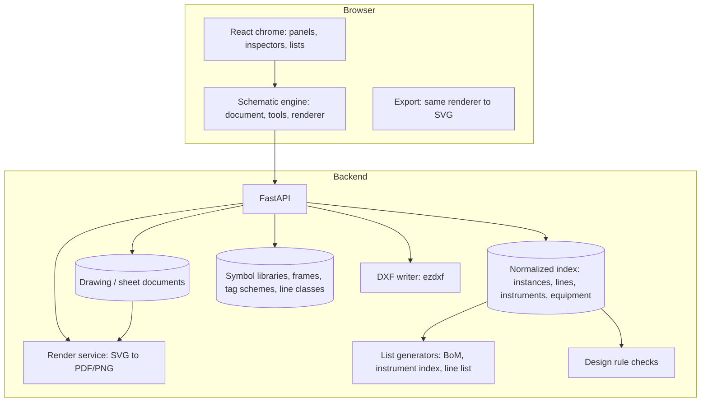

# P&ID Designer Upgrade Plan — From PFD Sketchpad to Professional Process Engineering Tool

Status: approved 2026-09-10; Phase 0 delivered (see §12). Phases 1–6 not yet implemented.
Audience: product, propulsion/test engineering, and whoever builds the editor.

This plan describes how the FSDP Diagrams page grows from the current React Flow sketchpad into a professional P&ID authoring and export tool that combines the drafting rigor of AutoCAD / AutoCAD P&ID, the library-and-connectivity discipline of KiCad's schematic editor, and FSDP's existing hardware, BoM, and requirements thread.

It is written against the current code (`frontend/src/App.tsx`, `frontend/src/components/pid/*`, `backend/app/models.py`, `backend/app/api/routes.py`) and against the reference drawing that sets the bar: Sierra Lobo drawing **AMB2-9003**, *Broad Area Cooling with Hybrid Additive Manufactured Pressure Vessel Project — P&ID, Phase 2, Fill Test* (E-size, AutoCAD).

---

## 1. The bar

The reference drawing is the acceptance standard. Every feature below is justified by something on that sheet. What the sheet contains, region by region:

| Region of the sheet | What it shows | Why it matters |
|---|---|---|
| **Drawing frame** | E-size sheet, zone grid A–H × 1–8, fold marks, "CAD DRAWING – DO NOT REVISE MANUALLY" banner | Every callout, review comment, and change notice references a zone (e.g. "PSV-3214 at D-4") |
| **Title block** | Company, project, drawing title (3 lines), SIZE, BLDG/SYS, PROJECT ID, TYP/SEQ number, SHEET 01 OF 01, REVISION, UNITS, SOFTWARE, SCALE, DATE, RELEASE STATUS, DR/CHK/APPROVED with dates, release-approval rows, registration stamp | The drawing is a controlled document. Identity and approval state live on the sheet, not in a side database |
| **Revisions table** | CHG NUM · DESCRIPTION · APP/DATE | Revision history is printed on the drawing itself |
| **General notes** | Numbered notes; note 1 references the controlled parts & instruments list document | Drawing ↔ list documents are cross-referenced by document number |
| **Line legend** | Helium, nitrogen, electrical connection, water — each a distinct line style | Line *service* is visible from line style alone |
| **Component prefix letters** | Tag anatomy diagram: `XXX` function letters over `XXXX` identification number; first digit = system (0 vacuum, 3 helium, 4 nitrogen, 7 water); second digit = 1 facility / 2 test hardware | Tagging is a *scheme*, configured per project, not free text |
| **Piping component symbols** | ~40 symbols: butterfly, check, gate, relief, ball, globe, 3-way, needle, directional valves, cylinder, loader, pressure regulator, strainer, filter, heat exchanger, venturi, reducer, flange, expansion joint, flex hose, rupture disc, pump, motor, cross-over valve, union, orifice, water separator, silencer, manifold, sight glass, vacuum jacket, float trap, quick disconnect, pneumatic/hydraulic/electric control valve, … | A real ISA/ISO symbol library, each symbol with defined connection points and a legend entry |
| **Actuator symbols** | Cylinder, hand, pneumatic control, rotary motor, solenoid | Actuators compose with valve bodies (KiCad "alternate body style" / AutoCAD P&ID "actuator" attachments) |
| **Primary control element symbols** | EP, EH, FS, HD, HS, LI, LLS, LLT, LS, LSC, LSO, MFC, MPS, PDS, PDT, PT, SD, TC, TE, TS, TT, VE, VART, XE, ZIT … | Instrument function letters follow ISA-5.1 and drive the tag |
| **Instrument symbols & PRM designations** | Bubble styles: general, locally mounted, control room, alternate control room, ref drawing, laptop controller, hardwired shutdown, data collector, PRM process controller, interlock | Instrument bubbles are semantic (location, function), not just circles |
| **Instrument letter table** | First letter (S, E, F, H, A, L, P, Q, T, V, X, Z, …) and succeeding letters (C, D, H, I, L, R, S, T, V, …) | ISA-5.1 table printed on the sheet |
| **Diagram body** | Instrument bubbles with letters over numbers (PT 3222, PCV 3225, PSV 3214, TC 3213, HV 4201 …); equipment blocks (H-3100 helium compressor, H-3101 cryocooler, V-0100 vacuum chamber, N-4200 storage tank, H-3212 circulator); line spec labels (`1/4" ST × .035" WALL`, `1/2" ST × .035" WALL`, `1/8" ST × .028" WALL`, `GARDEN HOSE, 3/8" NPT`); pressure/flow annotations (`0–3000 PSIG`, `2500/85 PSIG`, `40–50 PSIG 1.2 GPM ≤80°F`); size changes (`1/4"×1/2"`); set-pressure annotations (`10.5 PSIG BURST RV1`, `1 PSIG`, `100 PSIG`); off-sheet terminators (`VENT`, `LOCAL VENT`, `TO DRAIN`, `FACILITY WATER`, `LN2`, `GHe`, `TO POWER & DATA SYSTEM`, `DIODE SIGNAL`); nested boundaries (storage tank inside vacuum chamber, dashed); flow arrows mid-line; dashed signal lines; flex hoses with fitting callouts; tees, crossings, and junction dots | Lines are first-class objects with numbers, specs, and inline annotations; equipment has boundaries; connectivity is exact |
| **Proprietary notice** | Fixed legal text block | Sheet templates carry fixed content |
| **Export** | Vector, E-size, "NO SCALE", multi-sheet capable, DWG native + PDF | Export is a *print* of a paper-space document, not a screenshot of the screen |

**Acceptance test for this plan:** an engineer can reproduce AMB2-9003 in FSDP — same symbols, tags, line specs, annotations, legends, title block, zones — and export a vector PDF and a DXF that a reviewer cannot distinguish in content from the AutoCAD original; and the instrument index, line list, valve list, and BoM for that sheet are generated from the drawing with zero manual re-entry.

---

## 2. Honest baseline

What the editor is today, so the plan is a delta.

| Area | Current behavior | Where |
|---|---|---|
| Canvas engine | React Flow **v11** (`reactflow`, deprecated; superseded by `@xyflow/react` v12). Infinite pixel canvas, no paper space, no units | `frontend/package.json`, `App.tsx` |
| Document model | The raw React Flow `nodes`/`edges` JSON is the document (`Diagram.graph`), mirrored into `diagram_nodes` / `diagram_edges` rows on save. Coordinates are screen pixels | `buildGraphPayload` in `App.tsx:214`, `models.py` |
| Symbols | 10 built-in glyphs (valve, check valve, regulator, relief valve, sensor, filter, source/tank, sink, pump, junction) on a 64×40 viewBox, plus user-defined SVG symbols with ports (`pid_symbols` table, org-wide, unique name, no versioning, no categories, no legend entry) | `PidSymbols.tsx`, `SymbolEditorModal.tsx`, migration `0004` |
| Ports | Symbols declare ports in viewBox coordinates with a side; handles rotate with the glyph | `SYMBOL_PORTS`, `rotatedPortFraction` in `nodes.tsx` |
| Lines | One React Flow edge = one source-handle → target-handle connection. Orthogonal routing with draggable segments and waypoints. Tees only via explicit `pidJunction` nodes. Styling (color, dash, width, arrow) on the edge. Engineering data per edge: fluid, pressure, temperature, diameter, material. **No line number, no line class/spec, no from/to, no inline spec label, no signal-line semantics, no crossing convention** | `OrthogonalEdge.tsx`, `DiagramEdge` |
| Tagging | `suggestTag` produces `V-1`, `PT-2`, … from a hard-coded prefix map; tag stored on `ComponentInstance`, unique per diagram. No function-letter/loop-number model, no system digit, no scheme configuration | `App.tsx:105`, `uq_component_tag` |
| Instruments | A generic "sensor" circle. No ISA bubble (letters over number), no location style, no signal type, no range/setpoint fields | — |
| Equipment | Sections (colored rectangles carrying children when moved). No equipment tag, no nested boundaries semantics, no equipment list | `SectionNodeData` |
| Annotations | Free text nodes, comment pins, edge label. No leaders, no notes block, no revision clouds, no dimension/spec labels attached to lines, no flow arrows mid-line | `nodes.tsx`, `overlays.tsx` |
| Sheets | One infinite canvas per diagram. No frame, zones, title block, legend, multi-sheet, or off-page connectors | — |
| Revisions | `Diagram.revision` integer increments on every save; previous graph is overwritten. No revision table, no release state, no snapshot | `update_diagram_graph` in `routes.py:430` |
| Export | `html-to-image` PNG of the on-screen DOM at 2× pixel ratio; whatever is on screen at the time. No SVG, PDF, DXF | `exportDiagramPng` in `App.tsx:1496` |
| Lists | BoM snapshot rows roll up `ComponentInstance` by part. No instrument index, line list, valve list, equipment list | `services/bom.py` |
| Checks | BoM procurement readiness only. No drawing design-rule checks (unconnected ports, duplicate tags, dangling lines, missing relief, spec breaks) | `services/catalog.py` |
| Editing | Snap-to-grid (px), undo/redo (snapshot), duplicate, rotate 90°, context menu, selection toolbar, minimap, resizable panels. No keyboard command set, no copy/paste across diagrams, no align/distribute, no multi-select property edit, no find/replace tag | `App.tsx`, `overlays.tsx` |
| Thread | Part placement on a node (`ComponentInstance.part_id`), BoM, requirement trace links, change impact — all intact and to be preserved | `routes.py`, `services/*` |

Summary: the editor is a good **PFD sketchpad** with a real digital thread behind it. It lacks a document model with paper space, a standards-based symbol library, first-class lines, semantic instruments and tags, sheets with frames and title blocks, vector export, and generated engineering lists.

---

## 3. Product principles for the upgrade

1. **The model is the truth; the drawing is a view of it.** Symbols, lines, instruments, and equipment are engineering objects with fields. The sheet renders them. Lists (BoM, instrument index, line list) are queries over the same objects, never a parallel data entry.
2. **Library / instance separation (KiCad rule).** A *symbol* lives in a versioned library. Placing it creates an *instance* with its own fields (tag, service, set pressure). Editing a library symbol never silently rewrites released drawings; instances pin a symbol version and can be upgraded deliberately.
3. **Paper space exists.** Drawings are made of sheets with a size, frame, zones, and title block. World units are millimetres. Export is a print of paper space, identical in the browser and on the server.
4. **Standards first, house style second.** Symbols and tags follow ISA-5.1 (instrumentation), ISO 10628 / ISO 14617 (process symbols), ASME Y14.1 / ISO 5457 (sheet sizes and frames), ISO 7200 (title block fields), PIP PIC001 (P&ID documentation criteria). House overrides are configuration (library forks, tag schemes, frame templates), not code.
5. **Connectivity is exact.** A line ends on a port or on another line (tee). Junction dots are inferred from topology, not drawn by hand. A design-rule check tells the engineer what is unconnected, duplicated, or inconsistent, KiCad-ERC style. It warns; it does not block.
6. **Warn, don't block** (carried over from the catalog concept). Draft parts, rating mismatches, and missing data show as findings on the drawing and in the lists.
7. **Controlled documents.** A drawing has revisions with a description, drawn/checked/approved actors and dates, and a release state. Released revisions are immutable snapshots with stored PDF/DXF artifacts. Changes after release are clouded and listed in the revision table.
8. **Keyboard-first drafting.** A drafter must be able to place, wire, tag, rotate, mirror, and annotate without leaving the keyboard, with AutoCAD/KiCad-familiar bindings.
9. **Keep the thread intact.** `ComponentInstance.part_id`, BoM snapshots, trace links, and change impact keep working through every phase. New objects hang off the drawing model; they do not replace the catalog thread.
10. **Each phase ships something usable.** No big-bang rewrite of the Diagrams page; the current editor keeps working until the new one is better for daily work.

---

## 4. Gap matrix

Feature-by-feature: what AMB2-9003 needs, what exists, what the target is, and the phase that delivers it (phases are defined in §8).

| # | Capability | Current | Target | Phase |
|---|---|---|---|---|
| G1 | Document model with world units, layers, item kinds | React Flow JSON, pixels | Versioned schematic document (JSON schema) in mm, item kinds symbol/line/junction/instrument/equipment/label/note/cloud/connector, layers per service | 0 |
| G2 | Canvas engine | React Flow v11 | Purpose-built SVG schematic engine (see §5.2) with the same renderer used for export | 0–1 |
| G3 | Sheets, frames, zones, title block, revision table, notes block, legends | None | Drawing → sheets; frame templates (ANSI A–E, ISO A4–A0); title block fields bound to drawing/revision data; zone grid; auto-generated legends from symbols/lines actually used | 1 |
| G4 | Vector export | Raster PNG of DOM | SVG, PDF (single and multi-sheet, exact paper size, embedded fonts), PNG at chosen DPI, DXF (layers, blocks, text) | 1 (SVG/PDF/PNG), 6 (DXF) |
| G5 | Symbol library | 10 glyphs + ad-hoc custom SVGs | ISA-5.1 / ISO 10628 library (≈150 symbols) with categories, legend text, ports, default fields, actuator composition, versions; library manager UI; import from SVG/DXF blocks | 2 |
| G6 | Instrument bubbles | Generic circle | ISA bubble: function letters + loop/ID number, location style (field / panel / control room / PRM / interlock / hardwired shutdown), shared display flags, signal lines | 2 |
| G7 | Tag scheme | Hard-coded `V-1` | Per-project tag scheme: function letters table, ID number structure (system digit, hardware-class digit, sequence), separators, uniqueness scope (drawing set), auto-assign and renumber | 2 |
| G8 | Lines as first-class objects | Edge per connection | Line = network of segments with a line number, service/class, size, spec, from/to, design & operating P/T, insulation, tracing; tees and crossings by topology; inline spec labels; flow arrows; size-change and spec-break markers; signal/electrical line types | 3 |
| G9 | Off-sheet / off-page connectors | None | Terminator symbols (`VENT`, `TO DRAIN`, `GHe`) and sheet-to-sheet connectors with automatic cross-references (sheet/zone) | 3 |
| G10 | Equipment | Colored section | Equipment item with tag (H-3100), name, boundary (solid/dashed), nesting, nozzles as ports, equipment list | 3 |
| G11 | Engineering lists | BoM only | Instrument index, line list, valve list, equipment list, tie-in list; generated per sheet / drawing / project; XLSX and CSV; each row links back to the item and zone | 4 |
| G12 | BoM integration | Roll-up by part | Same, plus lists feed BoM (valves + instruments + specialty items), spec-driven bulk items (tubing by length, fittings by count), and "DNP"/spare flags per instance | 4 |
| G13 | Design rule checks | None | ERC/DRC: unconnected ports, dangling lines, duplicate tags, tag not matching scheme, line without number/spec, size mismatch at port, relief-protected volume rules, restricted/obsolete part used, rating below line design pressure, missing required fields per symbol class | 5 |
| G14 | Requirements | Trace link to component | Trace links to instruments, lines, and equipment; requirement-derived rules feed DRC; verification matrix rows from drawing items | 5 |
| G15 | Revision control | Integer counter, overwrite | Revision objects with description / drawn / checked / approved / date / status; immutable released snapshots with stored PDF/DXF; revision clouds and deltas; visual diff between revisions; release workflow | 6 |
| G16 | Drafting ergonomics | Basic | Keyboard command set, command palette, align/distribute, mirror, multi-select property edit, copy/paste with tag re-assignment, find tag, orthogonal wire tool with auto-junctions, drag-with-rubber-band, snap to ports/grid/guides, measure | 1–3 (incremental) |
| G17 | DXF/DWG interop | None | DXF export with layers and blocks; DXF import of frames and symbol blocks; DWG via converter (see §5.7) | 6 |
| G18 | Concurrency | Last write wins | Optimistic revision check on save; per-sheet edit lock with owner shown; later: live presence | 6 |

---

## 5. Target architecture

### 5.1 Overview



Two rules make this hold together:

- **One renderer.** The schematic renderer is a pure function `(document, libraries, frame, options) → SVG`. It runs in the browser for editing and on the server for export. What you see is what prints.
- **Document + index.** Each sheet's full document is stored as JSON (schema-versioned). On save the backend extracts normalized index rows (instances, lines, instruments, equipment) that lists, DRC, BoM, and change impact query. `diagram_nodes` / `diagram_edges` become that index.

### 5.2 Canvas engine decision

The central technical decision. Three options were considered:

| Option | Pros | Cons |
|---|---|---|
| A. Stay on React Flow v11 | Zero migration | Deprecated package; node/edge model cannot express multi-terminal lines, tees by topology, inline line annotations, or paper space without fighting the framework |
| B. Migrate to `@xyflow/react` v12, heavy custom edges/nodes | Supported package; keeps interaction plumbing | Same model mismatch: an edge is still source→target. Lines with tees need junction pseudo-nodes forever; no paper space; export still DOM-based unless a second renderer is written anyway |
| **C. Purpose-built schematic engine** (recommended) | Correct model (nets, segments, ports, sheets, mm units); one renderer for screen and export; KiCad-style tools become possible; existing math (orthogonal routing, port rotation, symbol SVG, sanitization) is already framework-independent and ports over | Largest upfront cost (≈6–8 engineer-weeks to reach parity with today's editor) |

Recommendation: **C**, de-risked by a two-week spike (Phase 0) that must demonstrate: 500 symbols + 800 line segments at 60 fps pan/zoom, port snapping, wire tool with auto-junction, undo, and pixel-identical SVG export. If the spike fails the bar, fall back to B with the new document model and accept the ceiling.

Engine design (TypeScript, no framework dependency; React only for chrome):

- **Document**: `{ schemaVersion, sheet: { size, frame, zones }, items: Item[], layers }`. Items are discriminated unions: `symbol`, `line` (segments + net id), `junction` (derived, persisted for stability), `instrument`, `equipment`, `label`, `note`, `cloud`, `connector`, `group`. Coordinates in mm; default grid 2.5 mm (ISA symbol module), fine grid 1.25 mm.
- **Command stack**: every mutation is a command with `apply`/`invert`; undo/redo is the stack. Commands are serializable, which later enables collaboration and change deltas.
- **Tools**: select, move, wire, place-symbol, place-instrument, label, note, cloud, measure. Each tool is a state machine over pointer/keyboard events, KiCad-style.
- **Snapping**: grid → port → line segment → guide, with priority and visual snap indicator.
- **Hit testing**: spatial index (R-tree) over item bounds; segment hit with tolerance scaled by zoom.
- **Renderer**: SVG, virtualized to viewport during editing; full sheet for export. Layers as `<g>` groups. Text uses a bundled metric-known font (e.g. ISOCPEUR-like open font or Inter) so line breaks and widths match on server.
- **Connectivity**: nets recomputed on every line/port change; junction dots derived where ≥3 segment ends meet, crossings rendered per configured convention (gap or plain cross).

### 5.3 Library subsystem

Modeled on KiCad symbol libraries.

- **Library**: name, source (built-in / org / project), version, standard reference, read-only flag.
- **Symbol**: key, name, category (valve, actuator, instrument, equipment, inline, fitting, terminator, signal), standard reference (e.g. ISA-5.1 §5.4.x), legend text, geometry (sanitized SVG primitives), ports (`{ id, x, y, side, kind: process|signal|nozzle, nominalSize? }`), default fields (per symbol class: valve → size, class, fail position; relief → set pressure; instrument → range, signal), tag function letters, allowed actuators, variants (e.g. normally open/closed), version.
- **Composition**: a valve body + actuator = one instance with two library references, rendered as one glyph (this is how the reference drawing's pneumatic/hand/solenoid valves are built).
- **Built-in library content** (Phase 2 deliverable), sized from the reference sheet plus common propulsion/test-stand needs: ≈60 piping components, ≈8 actuators, ≈40 instrument function symbols, ≈10 instrument bubble styles, ≈12 terminators/connectors, ≈15 equipment shapes, ≈10 line types.
- **Library manager UI**: browse by category, preview, versions, "where used", fork to org library, import from SVG (existing editor) and from DXF block, export library.
- **Instance pinning**: `instance.symbolRef = { library, key, version }`. Library upgrades are explicit ("3 drawings use v1 of BALL_VALVE; upgrade?").

### 5.4 Drawing set, sheets, frames

- **Drawing**: number (from a project drawing-number scheme, e.g. `{project}-{type}{seq}` → `AMB2-9003`), title (up to three lines), size, units, discipline, system, status, current revision.
- **Sheet**: belongs to a drawing; sheet number `01 OF N`; size and frame template; zone grid; own document.
- **Frame template**: SVG geometry for border, zone labels, fold marks; title block field slots with bindings (`{drawing.number}`, `{revision.letter}`, `{revision.approved_by}`, `{sheet.number}`, `{sheet.count}`, `{project.name}`, `{export.date}`); fixed blocks (proprietary notice, registration stamp placeholder); legend regions. Built-ins for ANSI A–E and ISO A4–A0 in both ISO 7200 and a Sierra-Lobo-like US layout; admins can upload a DXF/SVG frame and map fields.
- **Generated blocks on the sheet**: revision table (from revisions), general notes (from drawing notes with auto-numbering), line legend (line types used), symbol legend (symbols used, grouped by category), instrument letter table (from tag scheme). Each block is an item with a position; content is regenerated on render.
- **Zones**: computed from frame geometry; every item reports its zone (`D-4`) for lists, DRC findings, and review comments.

### 5.5 Tagging and numbering

Configured per project as a **tag scheme**, matching the "Component Prefix Letters" legend on the reference sheet:

```text
tag = {function letters}{separator}{identification number}
function letters: ISA-5.1 table (first letter + modifiers + succeeding letters), extended by house letters (H = helium hardware, N = nitrogen, V = vacuum, W = water on the reference)
identification number: {system digit}{hardware class digit}{sequence 2–3 digits}
  system digit map: 0 vacuum, 3 helium, 4 nitrogen, 7 water (per project)
  hardware class: 1 facility, 2 test hardware (per project)
uniqueness scope: drawing set (project) — not per sheet
```

Behavior:

- Placing a symbol proposes the next tag for its function letters within the selected system; the engineer can override.
- Renumber command re-sequences a selection or a system, preserving cross-references and trace links (tags are labels; instances have stable ids).
- DRC flags tags that do not parse under the scheme, duplicates, and gaps if the scheme asks for contiguous numbering.
- Equipment and lines have their own schemes (`H-3100`; line numbers such as `3"-GHe-3101-A1A` or house style).
- The existing `suggestTag` / `TAG_PREFIXES` map becomes the default scheme for projects without one.

### 5.6 Lines, nets, and annotations

- A **line** is a named net: ordered polylines of segments in mm, connecting ports (symbol/equipment nozzles) and other lines (tees). It carries: line number, service (fluid), line type (process, signal electric, signal pneumatic, capillary, jacketed, software link), size, spec/class (references a **line class** table: material, wall/schedule, rating, allowed sizes, insulation), from/to (derived from connectivity, editable), design P/T, operating P/T, insulation, tracing, test pressure, notes.
- **Rendering by line type** (the line legend): style, weight, dash pattern, and color per type; overridable per project. Flow arrows are placed per segment on demand or automatically at direction changes.
- **Inline annotations** attached to a line and following it: spec label (`1/2" ST × .035" WALL`), size-change marker (`1/4"×1/2"`), spec break, pressure/flow annotation. Attached items move with the line and export with it.
- **Crossings and tees**: derived. Tee → junction dot; crossing → configurable gap/no-gap. Engineers never draw dots.
- **Terminators and connectors**: `VENT`, `TO DRAIN`, `GHe`, `FACILITY WATER` are terminator symbols with a text field; off-page connectors reference a target sheet and item, and print the target sheet/zone automatically.
- **Signal lines** connect instrument bubbles to elements and to each other with electric/pneumatic/software types (dashed variants in the legend).

### 5.7 Export pipeline

| Format | Approach | Notes |
|---|---|---|
| SVG | Renderer output, full sheet at paper size (`width="864mm"` for E), fonts embedded or referenced | Editing and export share the renderer |
| PDF | Server render service: SVG → PDF via headless Chromium print (page size = sheet size, no margins, vector output, fonts embedded); multi-sheet drawings concatenated in sheet order; PDF metadata (title, number, revision) | Chromium/Playwright is already available in CI images; pure-Python fallback via CairoSVG for environments without a browser |
| PNG | Chromium screenshot of the SVG at chosen DPI (150/300/600) | Replaces `html-to-image` |
| DXF | Server-side `ezdxf` writer from the **document**, not from SVG: layers per line type and per item class, symbols as `INSERT` of `BLOCK` definitions (one block per library symbol version), text as `TEXT`/`MTEXT` with matching style, line specs as attributes; frame from template | Opens in AutoCAD, BricsCAD, DraftSight, LibreCAD |
| DWG | DXF → DWG via an external converter (ODA File Converter, licensed per site) wrapped as an optional service; otherwise deliver DXF | DWG is proprietary; DXF is the committed deliverable |
| Lists | XLSX (openpyxl) and CSV with a title row (drawing number, revision, date) and zone column | Instrument index, line list, valve list, equipment list, BoM |

Released revisions store their PDF, DXF, and list files as immutable artifacts alongside the document snapshot.

### 5.8 Digital thread integration

- **Instances ↔ parts**: unchanged (`ComponentInstance.part_id`). The assign-part flow from the catalog concept (Phase B) plugs into the new instance inspector. Symbol class and ports narrow the picker (a 1/4" tube port suggests 1/4" parts); mismatches warn.
- **Lists as the bridge to procurement**: valve list and instrument index rows are instances; the BoM rolls them up by part and adds bulk items derived from lines (tubing length by line class and measured segment length × scale factor set per line, fittings by counted connections) — the KiCad "BOM from schematic fields" idea.
- **Requirements**: trace links extend to `instrument`, `line`, `equipment`, and `drawing` targets. Requirements can declare machine-checkable constraints (`material in [316L]`, `relief on every isolable volume`) that DRC evaluates against the drawing; results feed the verification matrix.
- **Change impact**: walks drawing index rows, so "which sheets and lines use part X" and "which requirements touch tag PT-3222" are one query.
- **Reviews**: review comments are anchored to items and zones; a released PDF with a comment overlay is a review package.

---

## 6. Data model changes

New tables (Alembic migrations `0007+`). Existing tables are kept; `diagrams` becomes the sheet document holder during transition.

| Table | Purpose | Key fields |
|---|---|---|
| `drawings` | Controlled drawing identity | project_id, system_id, number (unique per project), title lines, size, units, discipline, status, current_revision_id |
| `drawing_sheets` | One document per sheet | drawing_id, sheet_no, frame_template_id, document (JSON, schema-versioned), document_hash, lock_owner, lock_expires |
| `drawing_revisions` | Printed revision history + release | drawing_id, letter/number, description, drawn_by/checked_by/approved_by (+ dates), status (working/for-review/released/superseded), snapshot (all sheet documents), artifacts (pdf/dxf/xlsx storage paths) |
| `frame_templates` | Sheet frames + title block field map | name, size, svg, field_bindings (JSON), fixed_blocks, zone_spec |
| `symbol_libraries` / `symbols` | Versioned library | library_id, key, version, category, standard_ref, legend_text, svg, ports (JSON), fields_schema (JSON), function_letters, allowed_actuators; unique (library_id, key, version) |
| `line_classes` | Pipe/tube spec table | org or project scoped; name, material, rating, wall/schedule per size, insulation default |
| `tag_schemes` | Per-project tag rules | project_id, function_letters (JSON table), id_structure (JSON), separators, equipment_scheme, line_scheme |
| `sheet_items` (replaces `diagram_nodes`) | Normalized index of every item | sheet_id, item_id (stable), kind, tag, symbol_ref, zone, fields (JSON), part_id (via `component_instances`) |
| `sheet_lines` (replaces `diagram_edges`) | Normalized line index | sheet_id, line_id, line_number, service, line_type, size, line_class_id, from_item, to_item, design/operating P/T, insulation, tracing |
| `drc_results` | Last check per sheet | sheet_id, rule, severity, item_id, zone, message, waived_by, waived_reason |
| `list_exports` | Generated list artifacts | drawing_id, revision_id, kind, storage_path |

Transition: `component_instances.node_id` is re-pointed at `sheet_items.id`; the current `Diagram` maps to a one-sheet drawing with the default frame; a converter turns the React Flow graph into a schematic document (pixels → mm at a fixed scale, edges → lines, `pidJunction` → tees, sections → equipment boundaries or groups). Legacy diagrams remain openable in the old editor until converted.

---

## 7. Editor UX

Layout, modeled on KiCad's schematic editor and AutoCAD P&ID's palettes, replacing the Diagrams page progressively:

- **Left**: library browser (search, categories, favorites, recent) and sheet navigator (drawing → sheets, with thumbnails and DRC counts).
- **Center**: sheet canvas in paper space with frame, zones, rulers, and grid; status bar with cursor position (mm and zone), grid size, snap mode, active layer, zoom, lock owner.
- **Right**: inspector for the selection (fields per symbol class, tag with scheme validation, part assignment, line data with line class picker, annotations), and a lists drawer (instrument index / line list / valve list / BoM for this sheet, filterable, click-to-locate).
- **Bottom**: DRC findings (severity, rule, zone, jump-to), and the command line / palette (`Ctrl+K`).
- **Keyboard**: `W` wire, `P` place symbol, `I` instrument, `L` label, `T` text, `N` note, `C` cloud, `R` rotate, `X`/`Y` mirror, `M` move, `D` duplicate, `Del` delete, `Esc` cancel, `F` fit, `Z` zoom window, `Ctrl+F` find tag, `Ctrl+Shift+R` renumber, `Ctrl+E` export, `Ctrl+Shift+D` run DRC. Bindings are configurable.
- **Placement**: drag from library or key command → ghost follows cursor with rotation/mirror live → click to place → tag proposed in inspector. Wire tool starts on a port, snaps orthogonally, ends on a port or a line (auto tee), with `Space` to flip the bend order.
- **Selection editing**: multi-select shares the inspector (edit line class for 12 lines at once); align/distribute; group.
- **Print preview**: exact sheet view with legends and title block filled; export dialog for SVG/PDF/PNG/DXF and lists.

---

## 8. Phased roadmap

Estimates are engineer-weeks for one experienced full-stack engineer, with a domain reviewer available. Phases 0–1 are sequential; 2–4 can overlap after 1; 5–6 follow.

### Phase 0 — Engine spike and document model (2–3 weeks)

- Define the schematic document JSON schema (items, lines, ports, layers, sheet) in mm; write the converter from today's React Flow graph.
- Build the engine core: document store, command stack (undo/redo), spatial index, SVG renderer with viewport virtualization, select/move/wire/place tools, grid and port snapping, auto-junction.
- Port existing framework-free code: orthogonal routing math, port rotation, symbol SVG rendering, `svgSanitize`.
- Performance bar: 500 symbols + 800 segments at 60 fps; export SVG byte-identical between browser and Node.
- Exit criteria: spike renders a converted copy of an existing FSDP diagram and a hand-built slice of AMB2-9003 (zone D-4: cold head, trim heater, TE/TY/SD loops) with wire tool and undo. Decision point: proceed with C or fall back to B (§5.2).

### Phase 1 — Sheets, frames, and vector export (4–5 weeks)

- `drawings`, `drawing_sheets`, `frame_templates`, `drawing_revisions` (working state only) tables and API.
- Built-in ANSI/ISO frames with zones and a title block bound to drawing/sheet/revision fields; general notes block; proprietary notice block.
- New editor page behind a feature flag: canvas in paper space, inspector, library panel with the existing 10 symbols + custom symbols, keyboard commands (§7).
- Export service: SVG, PDF (single sheet), PNG at DPI; export dialog; filename convention `{number}-{sheet}-rev{rev}.pdf`.
- Legacy diagrams open in the old editor; "Convert to drawing" creates a one-sheet drawing.
- Exit criteria: an engineer draws a frame-correct E-size sheet and exports a vector PDF whose title block, zones, and notes match the reference layout.

### Phase 2 — Symbol library, instruments, and tag schemes (5–6 weeks)

- Versioned symbol libraries with categories, legend text, ports with kinds/sizes, field schemas, actuator composition, variants.
- Author the built-in ISA-5.1 / ISO 10628 library (≈150 symbols listed in Appendix A), reviewed against the reference legend.
- Instrument items: bubble styles (field/panel/control room/PRM/interlock/hardwired shutdown/data collector), function letters, loop number, signal ports, range/setpoint/signal fields.
- Tag schemes per project (§5.5); auto-tag, renumber, scheme validation; migrate `suggestTag`.
- Auto-generated symbol legend and instrument letter table blocks.
- Library manager UI; upgrade the existing symbol editor to write library symbols (ports with kinds, legend text, fields).
- Exit criteria: every symbol on AMB2-9003's legend exists in the library with correct ports; tags like `PT 3222` and `HV 4201` validate under a configured scheme.

### Phase 3 — Lines, equipment, connectors (5–6 weeks)

- Line objects with numbers, service, type, size, line class, from/to, design/operating conditions; `line_classes` table with an admin editor and CSV import.
- Rendering by line type (line legend block auto-generated), flow arrows, crossings convention, inline spec labels, size-change and spec-break markers, attached annotations that follow the line.
- Equipment items with tags, nozzles, nested boundaries (solid/dashed); groups.
- Terminators and off-page connectors with automatic sheet/zone cross-references; multi-sheet drawings.
- Drafting ergonomics: align/distribute, mirror, copy/paste with tag reassignment, find tag, measure, drag-with-rubber-band.
- Exit criteria: AMB2-9003 fully reproduced (all lines with specs and annotations, vacuum chamber boundary with nested storage tank, terminators) and exported to PDF for side-by-side review.

### Phase 4 — Engineering lists and BoM integration (3–4 weeks)

- Index extraction on save (`sheet_items`, `sheet_lines`); list generators: instrument index, line list, valve list, equipment list, tie-in list; XLSX/CSV with drawing header and zone column.
- Lists drawer in the editor with click-to-locate; project-level lists across drawings.
- BoM generation reads the index: instances by part, bulk items from lines (tubing length, fittings by connection count), DNP/spare flags; readiness checks extended with drawing-derived issues.
- Catalog concept Phase B (assign-part modal, warnings, canvas badge) delivered inside the new inspector.
- Exit criteria: for AMB2-9003, the instrument index and line list match the drawing exactly and the BoM contains every tagged valve and instrument with a part or a "no part assigned" finding.

### Phase 5 — Design rule checks and requirements (3–4 weeks)

- DRC engine over the document + index: connectivity rules, tag rules, line rules, port size mismatch, missing required fields per class, restricted/obsolete part, rating below line design pressure, relief coverage of isolable volumes (graph analysis), spec continuity across tees.
- DRC panel with severity, waive-with-reason, jump-to-zone; DRC runs on save and on demand; findings on export cover sheet optional.
- Trace links to instrument/line/equipment/drawing; requirement constraints evaluated as DRC rules; verification matrix rows from drawing items.
- Exit criteria: a deliberately broken copy of AMB2-9003 (unconnected PT, duplicate HV tag, unnumbered line, 1/4" line into 1/2" port) yields exactly those findings; a "316L wetted" requirement flags a brass valve.

### Phase 6 — Revision control, review, DXF (4–5 weeks)

- Revision workflow: working → for review → released → superseded; drawn/checked/approved with roles; immutable snapshots; stored artifacts; revision table auto-filled on the sheet; revision letter/number scheme per project.
- Revision clouds and delta triangles; visual diff between two revisions (added/removed/changed items highlighted on the sheet; list diff for lines and instruments).
- Review comments anchored to items/zones; review package export (PDF with comment overlay + lists).
- DXF export (layers, blocks, attributes) and DXF import of frames and symbol blocks; optional DWG converter integration.
- Edit locking per sheet with owner display; optimistic save conflict detection.
- Exit criteria: a released revision of AMB2-9003 produces PDF, DXF, and lists that a reviewer opens in AutoCAD and Excel; a Rev A change shows clouds and a filled revision row.

### Later (not scheduled)

- Live multi-user editing (CRDT over the command stack).
- Analysis hooks: pressure-drop, relief sizing, trapped-volume detection reading the line/equipment graph (Epic 4).
- Hydraulic schematic and electrical loop diagram sheet types sharing the engine.
- 3D/isometric hand-off (line list → routing tools).
- AI-assisted placement and tag suggestions.

Total for Phases 0–6: roughly **26–33 engineer-weeks**. With two engineers and overlap after Phase 1, about **5–6 calendar months** to the full bar; Phases 0–3 (a drawing that looks and exports like the reference) in about **3 months**.

---

## 9. Testing strategy

- **Renderer golden tests**: SVG snapshots for every library symbol, every frame, and reference sheets; the same fixtures rendered in Node and compared byte-for-byte with the browser output.
- **Document schema tests**: converter round-trips for every existing seeded diagram; schema migration tests per version bump.
- **Engine unit tests**: routing, snapping, auto-junction, net recomputation, undo invertibility (property-based: random command sequences undo to the original document).
- **List and DRC fixtures**: AMB2-9003 recreated as a fixture document; expected instrument index, line list, valve list, and DRC findings checked in as CSV.
- **Export tests**: PDF page size and page count, embedded fonts, DXF parsed back with `ezdxf` and entity counts asserted.
- **E2E (Playwright)**: place, wire, tag, assign part, run DRC, release, export, download lists.
- **CI**: the existing workflow gains the render service (headless Chromium) and a Postgres service container.

---

## 10. Risks and mitigations

| Risk | Mitigation |
|---|---|
| Engine cost overruns; parity with today's editor takes longer than planned | Phase 0 spike with hard exit criteria and the documented fallback to `@xyflow/react` v12 on the same document model |
| Symbol library authoring is slow and error-prone | Author from the reference legend first; symbol editor upgraded early; review checklist per symbol (ports on grid, legend text, standard ref); import DXF blocks from existing house libraries |
| Font metrics differ between browser and server export | Bundle one open font, load it via `@font-face` in both, and golden-test text extents |
| DWG expectation | Commit to DXF; document the converter option; validate DXF in AutoCAD early (Phase 6 start) |
| Data migration of existing diagrams loses fidelity | Converter is tested against every seeded/production diagram; legacy editor stays available until each diagram is converted and confirmed |
| Scope creep from analysis features | Analysis stays out of scope until the line/equipment graph exists (after Phase 3); listed under "Later" |
| Single-engineer bus factor on the engine | Engine is a plain TypeScript package with its own tests and README; no React inside it |

---

## 11. Decisions to confirm

1. **Engine option C** (own SVG schematic engine) with the Phase 0 spike as the go/no-go.
2. **Units**: millimetres internally; display and title block units per drawing (the reference is `UNITS: ENGLISH`).
3. **Standards baseline**: ISA-5.1 for instrumentation and tags; ISO 10628/14617 for process symbols with a US-style legend; ANSI Y14.1 and ISO 5457 sheet sizes; ISO 7200 title block field set with a Sierra-Lobo-style layout as the first house template.
4. **Tag scheme default**: `{letters} {system}{class}{seq}` as on the reference, with the current `V-1` style available as a simple scheme.
5. **DXF as the CAD interchange deliverable**, DWG via optional converter.
6. **Release immutability**: released revisions cannot be edited; changes require a new revision.
7. **Legacy editor sunset**: removed one release after every production diagram is converted.

---

## 12. Delivery log

### Phase 0 — Engine spike and document model — ✅ delivered 2026-09-10

Decision: option C (own schematic engine) confirmed; the spike met its exit criteria, so there is no fallback to `@xyflow/react`.

Delivered in `frontend/src/engine/` (plain TypeScript, no React inside):

- `types.ts` — schematic document schema v1 in mm: sheet, layers, items (symbol, line, equipment, label, note), symbol refs `{library, key, version}`, library definitions.
- `geometry.ts`, `sheet.ts` — mm maths, orthogonalisation, sheet sizes (ISO A4–A0, ANSI A–E), zones (`D-4`).
- `library.ts` — 28 built-in ISA-style symbols authored on the 2.5 mm module (ports on grid, verified by test), adapter that wraps the existing user-defined SVG symbols, registry with version resolution and a placeholder for missing symbols.
- `commands.ts`, `store.ts` — serialisable commands with exact inverses (property-tested), undo/redo stack with drag coalescing and dirty tracking.
- `connectivity.ts` — nets from geometry, derived junction dots, dangling ends, open ports.
- `routing.ts`, `snap.ts`, `spatial.ts` — port-to-port orthogonal routing, port → segment → grid snapping, bucket spatial index, hit testing (ports before bodies, lines on segments, equipment on its border).
- `edit.ts` — move/rotate/mirror with rubber-band line ends and tee following, segment sliding, duplicate, tag suggestion.
- `render.ts` — the one renderer: item markup, junctions, frame with zone strip, full-sheet SVG at paper size. The React canvas and the export use the same functions.
- `convert.ts` — legacy React Flow graph → document (ids preserved, px → mm, edges → lines, junction nodes → tees, sections → equipment, text → labels, comments → notes).
- `editor.ts` — tool state machines (select/move/window/crossing/segment drag, wire with port and tee landing, place with rotate/mirror ghost, label, equipment, note) and the keyboard map.

Host and persistence:

- `frontend/src/components/schematic/SchematicCanvas.tsx` — SVG viewport in paper space (pan, wheel zoom, keyboard), overlays for selection, ports, snap target, wire preview, window selection.
- `frontend/src/pages/DraftingPage.tsx` — the **Drafting** page (nav entry, `/drafting`): opens a diagram's schematic document or converts its legacy graph on first open, toolbar, symbol palette, inspector, checks panel (nets, junctions, dangling ends, open ports), status bar (cursor mm, zone, zoom), SVG export, save.
- Backend: `diagrams.schematic` JSON column (migration `0007`), `GET/PUT /diagrams/{id}/schematic` with schema validation, change-log entry, viewer read-only.

Exit criteria checked:

| Criterion | Result |
|---|---|
| Converted copy of an existing diagram renders and stays connected | Converter tests: zero dangling ends, ids preserved; browser check on a sample fill-test sheet |
| Wire tool with auto-junction, undo | Editor tests: port → tee wire creates a junction; drags undo as one step |
| 500 symbols + 800 line segments | Full-sheet render of the benchmark fixture in well under 2 s in CI (typically ~100 ms); pan/zoom is a single transform, item re-render is per changed item |
| Screen and export identical | `renderDocumentSvg` is deterministic and shared; browser export re-rendered standalone matches the canvas |

Known limits carried into Phase 1: no title block or generated legends yet (frame and zones only), symbols are the Phase 0 starter set, auto-routing does not avoid symbol bodies, legacy diagrams are converted per open until saved from Drafting, and the classic Diagrams page remains the default editor.

## Appendix A — Built-in symbol library scope

Derived from the AMB2-9003 legend blocks, ISA-5.1, and ISO 10628. Names are library keys; each ships with legend text, ports, fields, and standard reference.

**Piping components (≈60):** ball valve, gate valve, globe valve, butterfly valve, needle valve, check valve (swing, lift, spring), 3-way valve, 4-way valve, plug valve, diaphragm valve, angle valve, cross-over valve, relief valve (spring), safety valve, rupture disc, pressure regulator (self-contained, dome-loaded), back-pressure regulator, loader, orifice plate, restriction orifice, venturi, flow nozzle, strainer (Y, basket), filter, coalescing filter, water separator, silencer, heat exchanger (shell & tube, plate), reducer (concentric, eccentric), flange pair, blind flange, union, cap, plug, expansion joint, flex hose, vacuum jacketed line, sight glass, float trap, quick disconnect, manifold, flow meter (turbine, coriolis, mass flow controller), demister, pump (centrifugal, positive displacement, vacuum), compressor, motor, cylinder, accumulator, tank (vertical, horizontal, dewar), bottle/cylinder pack, spray nozzle, weld (shop, field), tubing tee, cross.

**Actuators (≈8):** hand, hand lever, cylinder (pneumatic/hydraulic), diaphragm, pneumatic control, rotary motor, solenoid, electric motor.

**Instrument function elements (≈40):** EP, EH, FS, HD, HS, LI, LLS, LLT, LS, LSC, LSO, MFC, MPS, PDS, PDT, PT, PG, PS, PSV, PCV, SD, TC, TE, TS, TT, TG, VE, VART, XE, ZIT, ZS, FE, FT, FI, AE, AT, LT, LG, KS, YS.

**Instrument bubbles (≈10):** general discrete, locally mounted, control room, alternate control room, ref drawing, laptop controller, hardwired shutdown, data collector, PRM process controller, interlock, shared display/DCS, PLC.

**Terminators and connectors (≈12):** vent, local vent, drain, to atmosphere, supply (labelled), off-page connector (in/out), on-page connector, tie-in, utility connection, spec break, size change, flow arrow.

**Equipment shapes (≈15):** vessel, vacuum chamber (dashed boundary), storage tank, cryocooler, compressor package, circulator, cold head, heater, plate, skid boundary, panel boundary, enclosure, rack, test article, generic equipment box.

**Line types (≈10):** process (per service: helium, nitrogen, oxygen, water, fuel, generic), vacuum, electrical signal, pneumatic signal, software/data link, capillary, hydraulic, jacketed, mechanical link, future/existing.

## Appendix B — Reference sheet regions mapped to phases

| Sheet region | Phase |
|---|---|
| Frame, zones, title block, revisions table, notes, proprietary block | 1 |
| Symbol legends, instrument letter table, instrument bubbles, tag anatomy | 2 |
| Line legend, line specs and annotations, terminators, equipment boundaries | 3 |
| Referenced parts & instruments list document | 4 |
| Consistency of the sheet (connected, tagged, numbered) | 5 |
| Release state, approvals, revision letter, DWG/DXF | 6 |
