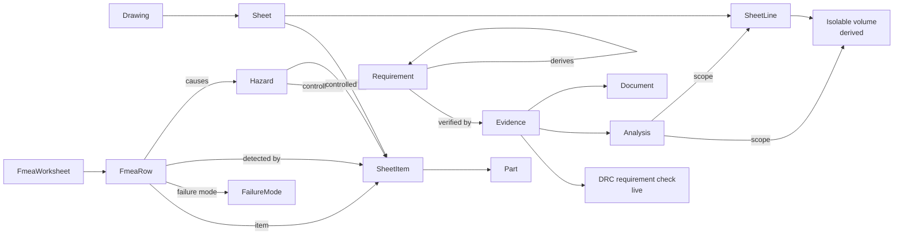

# Requirements, FMEA, and Safety Analysis Concept

Status: proposal (2026-09-11). Phase A implemented (2026-09-12); phases B–D not yet. Implementation plan: [safety-requirements-implementation-plan.md](safety-requirements-implementation-plan.md).
Audience: product, propulsion/GSE engineers, systems engineering, safety and mission assurance, and the reviewers who sign the hazard log.

This document describes the requirements, FMEA, and safety-analysis feature set for FSDP: what the objects are, how they hang off the drawing, the pages, the rules, and a phased path from the current stubs to a product that replaces the FMEA spreadsheet. It closes with a walk-through of a GSE engineer building a launch-pad fueling system with it, side by side with the Excel workflow it replaces.

It is written against the current codebase (`requirements`, `trace_links`, `drc_results`, `drc_requirement_checks`, `drc_waivers`, `sheet_items`, `sheet_lines`, the verification matrix, the Drafting DRC panel, and the `/safety` placeholder) and against Epics 5, 6, 9, and 10 in [requirements.md](requirements.md).

---

## 1. Thesis

An FMEA is a list of statements about hardware: *this valve, in this mode, can fail this way, with this effect, and here is what catches it.* In a spreadsheet every noun in that sentence is retyped text. The tag is text, the part is text, the downstream effect is text, the detecting instrument is text, the mitigating requirement is text. Nothing knows about anything else, so the sheet is correct on the day it is written and wrong from the first P&ID change onward.

FSDP already owns the nouns. Every tagged item on a saved sheet is a `sheet_items` row with a part, a zone, connected lines, and services. Every line is a `sheet_lines` row with service, size, and design conditions. Connectivity, isolable volumes, and relief coverage are computed by the engine on every save. Requirements already carry machine-checkable constraints that the DRC evaluates per item.

The safety feature set therefore does not add a spreadsheet to the app. It adds three thin object types (hazard, FMEA row, analysis) whose cells are **references** into the drawing, the catalog, and the requirements, plus the rules that make the references useful:

- an FMEA row points at an item, and goes stale when the item changes;
- a hazard is controlled by requirements, and is "controlled" only when those requirements verify;
- an analysis is derived from the sheet, and re-derives when the sheet is saved;
- change impact walks from a part or an item through rows and hazards to the requirement that now needs a second look.

The stated PRD metrics this serves: reduce safety review preparation time by 60%, reach 100% requirements traceability coverage, and change impact in under 1 minute.

---

## 2. What exists today

Honest baseline, so the concept is a delta.

| Area | Current behavior |
|---|---|
| Requirements object | `requirements`: key, title, text, type, verification method (free text), status, owner, optional `constraint` JSON. Project-scoped. No parent/child, no rationale, no revision, no applicability by mode or system. |
| Requirements page | One form and one table. Six constraint kinds (`material_in`, `material_not_in`, `pressure_rating_min`, `part_qualified`, `line_class_in`, `relief_required`) with service and category scope. Trace links to drawings and legacy components. |
| Verification matrix | `GET /projects/{id}/verification-matrix`: one row per requirement with pass/fail counts from `drc_requirement_checks` across saved sheets, verdicts `pass` / `fail` / `no_data` / `manual`, and link counts. Shown on the Requirements page. |
| DRC | 17 engine rules on save (connectivity, tags, line data, port sizes, spec continuity, part status and rating, `relief_coverage` over isolable volumes, requirement constraints). Findings stored per sheet, waivers by key with reason and actor. Drafting page panel; drawing-level roll-up endpoint. |
| Isolable volumes | `isolableVolumes()` in the engine: connected line groups bounded by isolating items, with `isolable` and `relieved` flags. Used only by DRC. |
| Trace links | Generic `(source_type, source_id, target_type, target_id, link_type)`. Targets validated for `requirement`, `component`, `drawing`, `sheet_item`, `sheet_line`. |
| Safety page | Placeholder text. |
| Reviews page | Change impact for a part or component (direct links, components, BoM snapshots) and the actor-stamped change log. |
| Certification page | Placeholder text. |
| Hazards, FMEA, analyses | Do not exist. Deferred in the PRD's MVP scope. |

The requirements slice is the strongest foundation in the app: constraints already turn a requirement into a live check. The concept extends that pattern rather than building a second verification path.

---

## 3. Jobs to be done

### GSE / propulsion engineer (the primary author)

- Get from a saved P&ID revision to a first-draft FMEA in minutes, not days.
- Rate and disposition rows in a grid that behaves like a spreadsheet (keyboard, fill-down, paste) but refuses to let a row point at hardware that is not on the drawing.
- See, on the drawing, which items have open hazards, missing detection, or stale rows.
- When a part is swapped or a line is rerouted, be told exactly which rows and hazards to reassess and nothing else.

### Systems engineer

- Import the customer's and the site's requirements once, derive the system requirements, and keep the derivation.
- Show a verification matrix where every safety requirement has a method, an owner, and evidence that is either live (DRC), attached (analysis, document), or pending (test).
- Prove 100% coverage: every catastrophic hazard has controls, every control is a requirement, every requirement has a verification path.

### Safety and mission assurance

- Own the hazard log: severity, likelihood, initial and residual risk, controls, verification of controls, acceptance.
- Enforce the fault-tolerance policy (for example two independent controls on any catastrophic hazard) as a computed check, not a reviewer's memory.
- Release a safety review package (hazard log, FMEA, verification matrix, open actions, risk matrix) that is pinned to a drawing revision and cannot drift.

### Responsible engineer / reviewer

- Open the review, see what changed since the last release, comment on rows, and approve a worksheet that freezes.

---

## 4. Design principles

1. **Reference, never retype.** Any cell that names hardware, a line, a requirement, an instrument, or a document is a picker bound to an FSDP object. Free text is for causes, effects, and rationale.
2. **Derive what the drawing knows.** Part, category, service, connected lines, containing volume, downstream items, and available detection instruments are filled from the sheet index and offered, not typed.
3. **Stale is a first-class state.** A row whose referenced item was retagged, re-parted, moved to another volume, or deleted is flagged, listed, and blocks release. It is never silently correct.
4. **One verification path.** Requirement verification uses the existing constraint and DRC machinery for anything the engine can check, and attaches evidence objects for the rest. No parallel "safety status" fields.
5. **Grid first, form second.** FMEA authoring is a keyboard-driven grid. The detail drawer exists for links and long text, not as the primary editing surface.
6. **Release freezes, work continues.** Worksheets and hazard logs release as snapshots pinned to drawing revisions, exactly like BoM snapshots. Editing continues on the working copy; diffs are computed.
7. **Excel is an export, not a data model.** XLSX in the customer's column layout is one click. It is never the source of truth.

---

## 5. Object model

### 5.1 `Requirement` (extended)

Existing columns stay. Added:

| Field | Meaning |
|---|---|
| `parent_id` | Derivation. A system requirement derived from a customer or site requirement points up. |
| `rationale` | Why the requirement exists. Mandatory for safety-derived requirements (auto-filled with the hazard key). |
| `category` | `functional`, `performance`, `safety`, `interface`, `environmental`, `manufacturing`, `verification`. Replaces free-text `requirement_type` on the UI; the column stays for compatibility. |
| `safety_critical` | Boolean. Set automatically when the requirement controls a hazard of severity I or II. |
| `applicability` | JSON: fluid systems, operating modes, services. Used to scope constraints and to filter. |
| `verification_method` | Enum: `test`, `analysis`, `inspection`, `demonstration`, `design_rule` (automatic). |
| `verification_status` | Computed: `planned`, `in_progress`, `verified`, `failed`, `waived`. Never edited directly; rolled up from evidence. |
| `revision`, `history` | Revision counter and `requirement_history` rows (field, old, new, actor, when). |
| `source_ref` | Free text reference to the originating document and clause (site safety standard, customer ICD). |

### 5.2 `Evidence`

One row per piece of proof attached to a requirement.

| Field | Meaning |
|---|---|
| `requirement_id` | Owner. |
| `kind` | `drc` (live, generated from `drc_requirement_checks`), `analysis`, `document`, `test`, `inspection`, `waiver`. |
| `ref_type`, `ref_id` | The analysis, catalog document, test record, or DRC check. |
| `status` | `pass`, `fail`, `pending`. For `drc`, mirrored from the latest check on every save. |
| `note`, `recorded_by`, `recorded_at` | Provenance. |

Roll-up: a requirement is `verified` when it has at least one evidence row and all are `pass`; `failed` when any is `fail`; `waived` when a waiver evidence exists and nothing fails; otherwise `planned` or `in_progress`.

### 5.3 `Hazard`

Project-scoped hazard log entry.

| Field | Meaning |
|---|---|
| `key` | `HZ-012`, unique per project, from a per-project counter. |
| `title`, `description` | What can go wrong. |
| `category` | `overpressure`, `backflow`, `ignition`, `contamination`, `trapped_fluid`, `cryogenic_exposure`, `asphyxiation_toxic`, `structural`, `loss_of_isolation`, `single_point_failure`, `other`. Matches Epic 6. |
| `system_id` | Optional fluid system scope. |
| `operating_modes` | Which modes the hazard applies in (from the project's mode list). |
| `severity_initial`, `likelihood_initial` | Scales from project settings (default MIL-STD-882 style: I–IV, A–E). |
| `severity_residual`, `likelihood_residual` | After controls. Computed risk index from the project matrix. |
| `status` | `open`, `controlled`, `accepted`, `closed`. `controlled` is computed: all controls are verified requirements. |
| `owner`, `accepted_by`, `accepted_at` | Accountability. |
| `fault_tolerance_required` | Integer, defaults from policy by severity (for example 2 for I and II). |

Links (trace links with new `link_type` values):

- `mitigates`: requirement → hazard (a control).
- `controls`: sheet_item → hazard (a hardware control such as a relief valve). Every hardware control must itself be covered by a requirement, or the dashboard flags it.
- `causes`: fmea_row → hazard.
- `evidenced_by`: hazard → analysis.

### 5.4 `FailureMode` library (organizational, edited in Settings)

| Field | Meaning |
|---|---|
| `category` / `symbol_key` | Which items this mode applies to. Category-level entries apply to every symbol in the category; symbol-level entries refine. |
| `name` | `fails_open`, `fails_closed`, `external_leak`, `internal_leak`, `fails_to_actuate`, `spurious_actuation`, `slow_response`, `stuck`, `fails_to_reseat`, `premature_lift`, `reverse_flow`, `clogged`, `element_rupture`, `erroneous_high`, `erroneous_low`, `drift`, `loss_of_signal`, `rupture`, `creep`, `lockup`, … |
| `default_local_effect` | Template text with placeholders (`{tag}`, `{service}`, `{downstream_tag}`). |
| `default_detection_hint` | Which instrument categories typically detect it (`PT`, `TT`, `FT`, `PDT`, `ZS`). |
| `default_severity` | Optional starting rating. |

Seeded for valves, regulators, relief devices, check valves, filters, hoses and flex lines, fittings and welds, pressure and temperature transmitters, flow meters, quick disconnects, and pumps.

### 5.5 `FmeaWorksheet`

| Field | Meaning |
|---|---|
| `project_id`, `system_id` | Scope. |
| `drawing_id`, `drawing_revision` | The drawing revision the worksheet was generated against and is pinned to at release. |
| `title`, `method` | `fmea` or `fmeca`. |
| `scales_id` | Which rating scales apply (severity, occurrence, detection, RPN threshold or criticality matrix). From project settings. |
| `operating_modes` | Modes in scope. |
| `status` | `draft`, `in_review`, `released`, `superseded`. |
| `revision` | Increments on each release. Released snapshots store frozen rows as JSON (like `bom_snapshots.rows`). |

### 5.6 `FmeaRow`

| Field | Bound to | Notes |
|---|---|---|
| `item_ref` | `sheet_items` by `(sheet_id, item_id)` | Resolved live to tag, part, category, zone. Stored with a copy of the tag and part number at last check, so staleness is detectable. |
| `failure_mode_id` or `failure_mode_text` | library | Custom modes allowed; flagged for library promotion. |
| `operating_modes` | project modes | Defaults from worksheet scope. |
| `cause` | text | |
| `local_effect` | text | Prefilled from the library template. |
| `next_effect` | text plus derived hint | The engine offers the item's containing volume and the items downstream in flow direction. |
| `end_effect` | text | |
| `detected_by` | `sheet_items` (instruments) or `none` or `procedure` | Picker lists instruments on connected lines first. |
| `severity`, `occurrence`, `detection` | scales | Integer ratings. `rpn` computed; or `criticality` for FMECA. |
| `existing_controls` | trace links | Requirements (`mitigates`) and hardware items (`controls`). |
| `hazard_id` | hazards | Optional. Rows with severity at or above the policy threshold must link a hazard before release. |
| `recommended_action`, `action_owner`, `action_due`, `action_status` | text and enums | `open`, `in_progress`, `done`, `not_required`. |
| `severity_residual`, `occurrence_residual`, `detection_residual` | scales | After actions. |
| `stale_reason` | computed | `retagged`, `part_changed`, `moved_volume`, `deleted`, `drawing_revised`. Cleared when the author confirms the row. |

### 5.7 `Analysis`

The generic analysis object from the product model, with engine-derived kinds first.

| Kind | Inputs (derived from the sheet) | Result |
|---|---|---|
| `trapped_volume` | Every isolable volume: lines, isolating items, service, estimated length, design conditions | List of volumes, each with `relieved` flag, relief device tag, and the temperature rise to reach design pressure for liquid-full cryogenic and hydraulic lines (first-order, from fluid bulk modulus and thermal expansion; assumptions stored). |
| `relief_scenario` | A volume plus a scenario: blocked outlet, regulator failure, thermal expansion, fire or external heat | Required relief capacity versus installed device capacity when the part carries it; else "capacity not on part" as a finding. |
| `single_point_failure` | Connectivity graph, isolation items, pressure sources, boundaries (vehicle interface, personnel area) | Items whose single failure removes all isolation between a source and a boundary. |
| `fault_tolerance` | A hazard and its controls | Count of independent controls (independence heuristic: different item, different part, different detection). |
| `compatibility` | Lines and their assigned parts | Part material versus line service against the catalog's compatibility table (from the catalog concept). |
| `manual` | Attached document | For anything the engine does not do yet (CFD, transient, external report). |

Each run stores inputs, assumptions, result JSON, verdict, actor, and the sheet's document hash, so a saved sheet with a different hash marks the analysis `outdated`.

---

## 6. Digital thread rules

1. **Binding.** An FMEA row is created only against an item that exists on a saved sheet. On every sheet save, the server re-resolves each row's `item_ref`; a changed tag, part, containing volume, or a deleted item sets `stale_reason`.
2. **Generation.** "Generate rows" takes a drawing revision, a category filter, and the failure-mode library and creates one row per (item, applicable mode). Existing rows for the same (item, mode) are kept; new items add rows; removed items mark rows stale. Generation is idempotent.
3. **Release gate.** A worksheet cannot be released with stale rows, rows above the severity threshold with no hazard link, rows with no detection and no recorded reason, or unassigned open actions.
4. **Hazard control.** A hazard is `controlled` only when every control link resolves to a requirement whose `verification_status` is `verified` or `waived`, and the number of independent controls meets `fault_tolerance_required`. Hardware controls (`controls` link from an item) count only when the item is covered by at least one requirement that applies to it.
5. **Residual risk.** Residual severity or likelihood can be lower than initial only when at least one control exists. The dashboard flags optimistic entries.
6. **Verification.** A requirement with a constraint gets a `drc` evidence row per sheet automatically; other requirements need at least one attached evidence to leave `planned`.
7. **Change impact.** Impact for a part, item, line, requirement, or hazard walks: part → items → FMEA rows → hazards → controlling requirements → evidence, and reports counts and keys. The existing `change_impact` service grows these edges.
8. **Auto-hazards (opt-in per project).** A `relief_coverage` DRC finding can create a draft hazard "Overpressure of isolable volume {name}" with category `trapped_fluid`, linked to the volume's lines, so the finding and the hazard cannot disagree. Waiving the finding requires the hazard to be `accepted` or `closed`.
9. **Snapshots.** Release of a worksheet or a hazard log stores frozen rows and the drawing revision. `GET /fmea/{id}/diff?against={revision}` reports added, removed, and changed rows, and rating changes, like the BoM diff.

---

## 7. Pages

### 7.1 Requirements (upgrade of `/requirements`)

Three-pane layout: filters and tree on the left, grid in the centre, detail drawer on the right.

- **Tree and filters.** By category, system, operating mode, verification status, safety-critical, source document. Parent/child derivation shown as a collapsible tree; flat list toggle.
- **Grid.** Key, title, category, method, status, verification status pill, evidence count, linked hazards, linked drawings. Inline edit of title, category, method, owner, status. Sort and column choice persist.
- **Detail drawer.** Text, rationale, source reference, applicability, constraint builder (existing kinds plus the new ones: `detection_required` for a category and service, `fault_tolerance_min` for a hazard category, `isolation_required` between two services), trace links grouped by type, evidence list with add and status, history.
- **Verification matrix tab.** Existing table plus method, owner, evidence status, and a coverage bar (verified / failed / planned / manual by category).
- **Coverage tab.** Requirements with no trace to any drawing or item; safety-critical requirements with no evidence; hazards with no controls; controls that are not requirements.
- **Import and export.** CSV/XLSX with a column mapper (key, title, text, category, method, parent key, source ref). Exports the grid and the matrix as XLSX and the matrix as PDF.

### 7.2 Safety (replaces the `/safety` placeholder)

A hub page with five tabs.

**Overview.** Risk matrix heat map (severity × likelihood, toggle initial versus residual, click a cell to filter the hazard log), open hazards by category, uncontrolled catastrophic hazards, stale FMEA rows, isolable volumes without relief, single-point failures, requirements coverage bar, worksheets by status. Every tile is a link to the filtered list.

**Hazard log.** Grid with key, title, category, system, modes, initial risk, residual risk, controls count and verified count, fault-tolerance verdict, status, owner. Detail drawer: description, causes (linked FMEA rows with locate-on-sheet), controls (requirements and hardware items, each with verification status), analyses, residual risk with justification, acceptance signature, history. Actions: add control (requirement picker or item picker), derive requirement (creates a safety requirement with rationale prefilled and the `mitigates` link), attach analysis, accept.

**FMEA.** Worksheet list (title, drawing and revision, status, rows, stale, open actions, RPN above threshold). Worksheet view is the grid described in §8. Header shows drawing revision drift ("generated against rev B, drawing now rev C, 6 rows stale") with Regenerate and Review stale actions.

**Analyses.** List of analyses by kind with verdict, scope, outdated flag, and evidence use. Each analysis page shows derived inputs (with locate-on-sheet), editable assumptions, results, and an "Attach as evidence" action that offers the requirements applying to the scoped lines.

**Design rules.** Project-wide view of DRC findings across drawings (existing endpoints), grouped by rule and severity, with waivers and their reasons, and a link from each `relief_coverage` finding to its hazard when the auto-hazard rule is on.

### 7.3 Drafting page: safety layer

- A **Safety** toggle in the sheet toolbar colors isolable volumes by the highest residual risk of hazards scoped to them and badges items with counts of open FMEA rows, open hazards, and stale rows.
- The inspector gains a **Safety** tab for the selected item or line: FMEA rows (with inline rating edit), hazards, controlling requirements, detection coverage, and "Add failure mode" which opens a prefilled row in the worksheet for this drawing.
- The DRC panel's `relief_coverage` findings gain "Create hazard" and "Open hazard".

### 7.4 Reviews and Certification

- **Reviews** gains a **Safety review package** action: pick a project, systems, drawing revisions, and worksheets; the server produces a PDF (hazard log, risk matrix, FMEA sorted by RPN, verification matrix, open actions, DRC findings and waivers) and an XLSX bundle. Packages are stored and listed with the change log entries since the previous package.
- Worksheet and hazard-log release gets an approval row (engineer, safety, responsible engineer) using the review workflow when Epic 10 lands; until then, release records the actor.
- **Certification** lists released worksheets, accepted hazards, and verified safety requirements as evidence items, with missing evidence called out.

### 7.5 Settings

- Failure-mode library editor (category, symbol, name, effect template, detection hint, default severity).
- Rating scales: severity, occurrence, and detection definitions with descriptions; RPN action threshold; or the criticality matrix for FMECA.
- Risk matrix: severity and likelihood scales and the cell-to-risk-class mapping.
- Fault-tolerance policy by severity class.
- Operating modes per project (default: standby, chilldown, slow fill, fast fill, topping, hold, drainback, purge, abort/safe).
- Hazard categories (extendable).
- Auto-hazard from `relief_coverage` on or off.

---

## 8. The FMEA grid

This is the page an engineer lives in, so it is specified in detail.

**Columns (default order, all reorderable and hideable):** Item (tag, with part number and category beneath), Zone, Failure mode, Modes, Cause, Local effect, Next effect, End effect, Detected by, S, O, D, RPN, Controls, Hazard, Action, Owner, Status, Residual S/O/D, Notes, Stale.

**Behavior:**

- Arrow keys, Tab, Enter move; typing starts editing; Escape cancels; Ctrl+Z undoes across cells.
- Item, Failure mode, Detected by, Controls, and Hazard cells open pickers on typing; the picker for Item lists the sheet's tagged items with part and zone and searches by tag, part number, or symbol name; the picker for Detected by lists instruments on the same or connected lines first.
- Fill-down (Ctrl+D) and multi-cell paste for text and ratings; paste into a reference cell resolves by tag and rejects unknown tags with a clear message.
- Rating cells accept the digit keys and show the scale definition on hover; RPN recomputes instantly and cells above the threshold get a severity stripe.
- Group by item, by volume, by hazard, or by mode; filter by stale, by RPN above threshold, by missing detection, by open action.
- Row menu: locate on sheet (opens the Drafting page on the item), duplicate for another mode, link hazard, derive requirement, mark not applicable with reason.
- Stale rows show a banner with what changed ("FV-201: part changed AMPH-VL-014 → AMPH-VL-022, fail-safe position closed → as-is") and Confirm / Reassess.
- Export: XLSX in the FSDP layout or a saved column mapping (customer template), PDF landscape with the drawing header.
- Comments per row (reviewers), shown as a count with a thread in the drawer.

---

## 9. API sketch

Paths follow the existing style.

Requirements and evidence:

- `GET/POST /projects/{id}/requirements` (existing, with new filters), `PUT /requirements/{id}`, `GET /requirements/{id}/history`
- `POST /projects/{id}/requirements/import`, `GET /projects/{id}/requirements/export?format=xlsx`
- `GET/POST /requirements/{id}/evidence`, `DELETE /evidence/{id}`
- `GET /projects/{id}/verification-matrix` (existing, extended), `GET /projects/{id}/requirements/coverage`

Hazards:

- `GET/POST /projects/{id}/hazards`, `GET/PUT/DELETE /hazards/{id}`
- `POST /hazards/{id}/controls` (requirement or item), `POST /hazards/{id}/derive-requirement`, `POST /hazards/{id}/accept`
- `GET /projects/{id}/hazards/matrix` (risk matrix counts)

FMEA:

- `GET/POST /projects/{id}/fmea`, `GET/PUT/DELETE /fmea/{id}`
- `POST /fmea/{id}/generate` (drawing, revision, categories, modes), `GET /fmea/{id}/stale`
- `GET/POST /fmea/{id}/rows`, `PUT/DELETE /fmea/rows/{id}`, `POST /fmea/{id}/rows/bulk`
- `POST /fmea/{id}/release`, `GET /fmea/{id}/diff?against=`, `GET /fmea/{id}/export?format=xlsx|pdf`

Failure modes and settings:

- `GET/POST/PUT/DELETE /failure-modes`
- `GET/PUT /projects/{id}/safety-settings` (scales, matrix, policy, modes, categories, auto-hazard)

Analyses:

- `GET/POST /projects/{id}/analyses`, `GET /analyses/{id}`, `POST /analyses/{id}/run`, `POST /analyses/{id}/attach-evidence`
- `GET /sheets/{id}/volumes` (isolable volumes with service and conditions, from the stored index)

Safety and reviews:

- `GET /projects/{id}/safety/summary`
- `POST /projects/{id}/safety/package`, `GET /projects/{id}/safety/packages`, `GET /safety/packages/{id}/pdf|xlsx`
- `GET /changes/impact` (existing) walks the new edges.

Sheet save (`PUT /sheets/{id}`) additionally re-resolves FMEA rows and marks analyses outdated. Trace-link validation accepts `hazard`, `fmea_row`, `analysis`, and `evidence` types.

---

## 10. Data model additions

New tables: `requirement_history`, `requirement_evidence`, `hazards`, `failure_modes`, `fmea_worksheets`, `fmea_rows`, `fmea_row_comments`, `analyses`, `safety_packages`, `safety_settings` (one row per project, JSON). One migration per phase.

`fmea_rows` keeps `sheet_id`, `item_id`, `item_tag_seen`, `part_id_seen`, `volume_key_seen` to detect staleness without a second table. Released worksheets keep `rows` JSON on `fmea_worksheets` per revision in `fmea_releases`.

---

## 11. Permissions

| Action | viewer | engineer | admin |
|---|---|---|---|
| Read everything | yes | yes | yes |
| Edit requirements, rows, hazards, analyses | no | yes | yes |
| Waive a DRC finding, mark a row not applicable | no | yes, with reason | yes |
| Accept a hazard, release a worksheet | no | only when the project's safety role is granted | yes |
| Edit scales, policy, failure-mode library | no | no | yes |

A per-project `safety_approver` grant (list of users) is the first step toward Epic 10's roles without building the whole workflow engine.

---

## 12. Explicitly out of scope

- Fault tree construction and cut-set computation (deferred in the PRD; `single_point_failure` covers the most-asked question).
- Transient or CFD relief sizing; the relief scenario analysis is first order and states its assumptions.
- Quantitative reliability data import (failure rate databases). Occurrence stays an ordinal rating.
- Test records and as-built serials (Epic 8). Test evidence is a document attachment until then.
- Full approval routing (Epic 10). Release records an actor and, optionally, a named approver.

---

## 13. Phased delivery

### Phase A: Hazard log and requirements upgrade

Hazards table and page, `mitigates` and `controls` links, evidence rows with the `drc` kind generated from existing checks, requirement categories, derivation, history, import and export, coverage tab, Safety overview with the risk matrix. No FMEA yet. Delivers: a hazard log whose controls are verified requirements.

### Phase B: FMEA worksheets

Failure-mode library and Settings editor, worksheets and rows bound to sheet items, Generate, the grid, staleness on save, release with frozen rows, XLSX and PDF export, row comments. Delivers: the spreadsheet replacement.

### Phase C: Engine analyses and the drawing overlay

Volumes endpoint, `trapped_volume`, `relief_scenario`, `single_point_failure`, and `fault_tolerance` analyses with outdated tracking, evidence attachment, Drafting safety layer and inspector tab, auto-hazard from `relief_coverage`, change impact through rows and hazards. Delivers: the drawing tells the engineer where the risk is.

### Phase D: Review packages and certification evidence

Safety review package generation and storage, diffs against previous packages, per-project safety approver grant, Certification page evidence list. Delivers: review preparation in minutes.

---

## 14. Walk-through: a launch-pad fueling system

The engineer is the GSE fluids lead for a small launcher. The system is a pad LOX fill and drain system: a storage tank, a transfer pump, a filter, a flow meter, a fill valve, a chilldown bleed, a drainback line, a vehicle quick disconnect, GN2 purge tie-ins, and vent and relief devices. Operating modes: standby, chilldown, slow fill, fast fill, topping, hold, drainback, purge, abort/safe. The site's safety standard requires a hazard analysis, an FMEA, and a verification matrix before pad activation.

Below, each step shows the FSDP path and the spreadsheet path the team used on the previous vehicle.

### Step 1: Requirements in (day 1)

**Excel.** The site standard arrives as a PDF. The systems engineer builds `Requirements_LOX_GSE_v1.xlsx` with 140 rows, typing clause numbers by hand. Derived requirements are new rows with a "parent" column of text. The P&ID lives in a CAD file; "applies to" is a column of tag text.

**FSDP.** Import the 140 rows through the column mapper (key, title, text, source clause, category). Derive the LOX system requirements from their parents in the tree; the derivation link is kept. Three requirements become constraints immediately: every isolable LOX volume has thermal relief (`relief_required`, scoped to service LOX), all wetted parts are 316L or brass with LOX-compatible seats (`material_in`, scoped to LOX), and fill-line pressure rating at least 40 bar (`pressure_rating_min`). Link the rest to the drawing. The verification matrix shows `no_data` for the constraints because no sheet is saved yet, and `planned` for everything else.

Time: an afternoon in both cases. The difference is that FSDP's rows are objects with parents and applicability, not text.

### Step 2: P&ID and the first hazard (day 2)

**Excel.** The engineer draws the P&ID in CAD. Nobody checks trapped volumes until the safety reviewer, weeks later, spots the section between the fill valve FV-201 and the vehicle quick disconnect QD-201 and asks where the thermal relief is.

**FSDP.** On the first save of sheet 1, DRC raises `relief_coverage`: "Isolable volume (L-2014, L-2015) has no relief device." With auto-hazard on, hazard HZ-012 "Overpressure of isolable volume L-2014/L-2015 by thermal expansion of trapped LOX" appears in the log with category `trapped_fluid`, modes hold and abort/safe, severity I (line rupture next to the vehicle). The engineer adds thermal relief valve TRV-201 to the volume and saves. The DRC finding clears, the `relief_required` constraint passes for that volume, and HZ-012 shows one hardware control (TRV-201) covered by the relief requirement, which is now `verified` by live DRC evidence. Fault tolerance policy for severity I asks for two independent controls, so HZ-012 stays `open` with the reason "1 of 2 controls". The engineer derives a second requirement from the hazard: the hold procedure shall open the drainback valve before isolating the fill line. It is a `demonstration` requirement, `planned` until the procedure is signed off.

Time: minutes, and the hazard is on the log the day the volume exists.

### Step 3: Generate the FMEA (day 3)

**Excel.** Open last vehicle's `FMEA_LOX_GSE_v7_FINAL.xlsx`, delete the rows that do not apply, retype the tags of the 47 new items, copy failure modes from the old rows. Two days, and three tags are typed wrong (a hyphen missing, an old tag left in).

**FSDP.** On the Safety page, New worksheet: system LOX fill and drain, drawing GSE-LOX-001 rev B, categories valves, regulators, relief devices, check valves, instruments, hoses, quick disconnects; modes all. Generate creates 178 rows in a few seconds: 47 items × their library failure modes × the modes where the mode applies. Every row already carries tag, part number, zone, service, local effect text from the template, and a detection suggestion (PT-205 for FV-201 fails closed, because PT-205 is on the connected line). The engineer spends the day rating S/O/D in the grid with the number keys, filling down where the effect is the same, and links rows above the RPN threshold to hazards. Eleven rows link to HZ-012. Four rows for the pump discharge check valve get a new hazard, HZ-015 "Backflow of LOX into pump on trip".

Time: one day of judgement instead of two days of typing followed by judgement. No mistyped tags exist because tags cannot be typed.

### Step 4: The change (week 2)

**Excel.** Procurement swaps FV-201 to a different vendor's valve with a fail-as-is actuator. The BoM changes. The FMEA still says fails closed on loss of power. The hazard log still credits "FV-201 fails closed" as a control on the fast-fill overpressure hazard. Nobody notices until a reviewer reads both documents side by side at the review, or does not.

**FSDP.** The part is reassigned on the sheet and saved. Change impact for FV-201 lists: 4 FMEA rows stale (part changed, fail-safe position closed → as-is), 2 hazards affected (HZ-009 fast-fill overpressure, HZ-012), 1 requirement whose `controls` link now points at a part with a different behavior. The Safety overview shows "4 stale rows, 1 hazard downgraded to open". The engineer opens the stale filter, reassesses the four rows, updates the fail-safe cause text, and adds a hardware control on HZ-009: the upstream pump trip interlock, which is already on the drawing as an instrument. HZ-009 returns to `controlled`.

Time: under an hour, with a complete list. The point is not speed; it is that the list is complete by construction.

### Step 5: Review (week 3)

**Excel.** Assemble the review package: export the hazard log, the FMEA, the requirements matrix, the P&ID PDF, and an open-actions list from four files, reconcile tags between them, reformat into the site template, email as attachments, receive comments in email and in three marked-up copies, merge by hand.

**FSDP.** Reviews page, Safety review package: LOX fill and drain, drawing rev C, worksheet rev 1. The PDF has the hazard log with risk matrix, the FMEA sorted by RPN with the drawing header, the verification matrix with evidence status, open actions, DRC findings and waivers, and the change log since the last package. Reviewers comment on rows in the grid. The safety lead accepts HZ-012 with justification, the responsible engineer releases the worksheet, which freezes it against rev C. Next month's drawing rev D will show a diff against this release.

Time: preparation in minutes; comments land on the row they concern.

### What the engineer gives up

- Formatting freedom. The grid is the grid; customer layouts are export mappings.
- Working offline on a laptop in the blockhouse. Export XLSX for that; re-import is not supported for rows, only for ratings by row key.
- Rows about things not on the drawing (procedures, people, weather). Allowed as rows with an `item_ref` of `none` and a subject text, but they do not participate in staleness or the overlay.

### Summary of the difference

| | Spreadsheet | FSDP |
|---|---|---|
| Identity of a row's hardware | Typed text | Reference to the sheet item, resolved live |
| First-draft FMEA for 47 items | About two days | Minutes to generate, one day to rate |
| Trapped volume found | At review, by a careful reader | On first save, by the engine, with a hazard created |
| Part swap | Nothing changes in the FMEA | Stale rows and affected hazards listed in under a minute |
| Hazard control status | A column someone updates | Computed from verified requirements and the fault-tolerance policy |
| Verification of a material requirement | Someone reads the BoM | Live DRC evidence per item on every save |
| Review package | Half a day of assembly and reconciliation | Generated, pinned to the drawing revision |
| Comments | Email and marked-up copies | On the row, in the thread |
| Version control | File names | Releases with diffs |

---

## 15. Success criteria

- A saved drawing with 40 or more tagged items yields a generated worksheet with no unbound rows.
- After a part reassignment, every FMEA row referencing the item is stale within one save, and change impact returns in under one minute.
- Zero hazards of severity I or II reach `controlled` without the policy's number of verified, independent controls.
- The verification matrix shows a non-`manual`, non-`no_data` verdict for every requirement that has a constraint and at least one saved sheet.
- A safety review package for a project with one drawing and one worksheet generates in under a minute.
- Safety review preparation time, measured on the first real project, drops by at least the PRD's 60%.

---

## 16. Open questions for review

1. Should failure-mode library entries be organization-wide only, or allow per-project overrides? Proposal: organization-wide with per-project additions, like custom symbols.
2. FMECA criticality versus RPN: ship both scales or RPN first? Proposal: RPN first, criticality matrix in Phase B if a customer standard requires it.
3. Independence heuristic for fault tolerance: is "different item and different detection" sufficient, or is a manual independence flag needed? Proposal: heuristic plus a manual override with a reason.
4. Rows for non-hardware subjects (procedures, operators): keep them in the same worksheet or in a separate operational hazard analysis? Proposal: same worksheet, `item_ref` of `none`, until an OHA feature exists.
