# Requirements, FMEA, and Safety Analysis: Implementation Plan

Status: plan (2026-09-12). Implements [safety-requirements-concept.md](safety-requirements-concept.md).
Audience: the engineers building it, and whoever schedules them.

The plan is organised as four phases, each a shippable slice, broken into work packages sized for one pull request. Every package names the migration, models, schemas, routes, services, frontend files, and tests it touches, and the acceptance check that closes it. Estimates are engineer-days for someone who knows the codebase; a two-person team splits most packages along the backend/frontend line after the phase's schema package lands.

---

## 1. Conventions this plan follows

Observed in the codebase and kept, so the new code reads like the old.

| Concern | Convention |
|---|---|
| Migrations | `backend/alembic/versions/NNNN_name.py`, one per phase, `down_revision` chained. Next is `0013`. Timestamp columns via the local `_timestamps()` helper. |
| Models | `backend/app/models.py`, `TimestampMixin`, `String(36)` UUID keys via `uuid_str`, JSON columns for flexible payloads, `ondelete="CASCADE"` on owned rows. |
| Schemas | `backend/app/schemas.py`, `OrmModel` for reads, `*Create` / `*Update` / `*Read` triples, `field_validator` for blank-string and enum checks, `AliasChoices` for camelCase payloads from the engine. |
| Routes | New router module per domain (`drawing_routes.py` is the pattern): `backend/app/api/safety_routes.py` with `safety_router`, included in `main.py` behind `get_current_user`. Writers use `require_writer`; every mutation calls `record_change(db, object_type, object_id, action, summary, actor=user.email)`. `require_model` for 404s. |
| Services | Pure functions over a `Session` in `backend/app/services/*.py`; routes stay thin. |
| Trace links | Extend `TRACE_OBJECT_MODELS` in `routes.py`; new `link_type` values are strings, validated in the service that reads them. |
| Frontend pages | New page components in `frontend/src/pages/`, registered as routes in `App.tsx` with `PageLayout`. `App.tsx` gets a route entry and nothing else; the safety pages own their state. |
| Frontend API | Add functions to the `api` object in `frontend/src/api.ts`; types in `frontend/src/types.ts`, aligned with the read schemas. |
| Engine | Pure TypeScript in `frontend/src/engine/`, tested with vitest without React. |
| UI kit | `Panel`, `DataTable`, `Select`, `TextInput`, `TextArea`, `StatusPill`, `FormError` from `components/ui.tsx`; resizable panes from `components/resizable.tsx`; modals follow `AssignPartModal`. |
| Backend tests | `backend/tests/test_*.py` against `TestClient` with in-memory SQLite and foreign keys on (`conftest.py`). One file per phase, workflow-style. |
| Frontend tests | vitest with `@testing-library/react`, `api` mocked with `vi.hoisted` (see `DraftingPage.test.tsx`). Engine tests next to the module. |
| Lint and CI | `ruff` (E, F, I, UP, B; line length 100), `eslint`, `tsc -b`. CI runs both on every PR. |
| Seed | Extend `backend/app/seed.py` so the Amphora demo shows the feature. |
| Docs | Update `docs/implementation.md` (API summary, data model) and `docs/requirements.md` (coverage) in the last package of each phase. |

Two cross-cutting decisions made here so packages do not re-decide them:

1. **Staleness is computed on the server during sheet save.** `update_sheet` already replaces the index (`replace_sheet_index`). A new `services/safety_sync.py` runs after it, diffs the previous `sheet_items` rows against the incoming index, and updates `fmea_rows.stale_reason` and `analyses.outdated`. The engine does not know about FMEA rows.
2. **Volumes are sent by the engine as part of the index payload.** `isolableVolumes()` already runs inside `runDrc`. `SheetIndexIn` gains an optional `volumes` list (id, line ids, item ids, isolable, relieved, service, longest line design conditions). The server stores them in `sheet_volumes` so hazards, analyses, and FMEA rows can reference a volume key without re-deriving connectivity in Python.

---

## 2. Phase map and dependencies

```mermaid
flowchart LR
  A1[A1 schema] --> A2[A2 hazards API]
  A1 --> A3[A3 requirement evidence and roll-up]
  A2 --> A4[A4 Safety page: overview and hazard log]
  A3 --> A5[A5 Requirements page upgrade]
  A3 --> A6[A6 import and export]
  A4 --> A7[A7 seed, docs, coverage tab]
  A5 --> A7
  A7 --> B1[B1 schema and failure-mode library]
  B1 --> B2[B2 worksheets, rows, generate]
  B2 --> B3[B3 staleness on save]
  B2 --> B4[B4 FMEA grid]
  B3 --> B5[B5 release, diff, export]
  B4 --> B5
  B5 --> B6[B6 comments, seed, docs]
  B6 --> C1[C1 volumes in index]
  C1 --> C2[C2 analyses API and runners]
  C1 --> C3[C3 drafting safety layer]
  C2 --> C4[C4 auto-hazard and change impact]
  C3 --> C5[C5 analyses page]
  C4 --> C6[C6 seed, docs]
  C5 --> C6
  C6 --> D1[D1 packages]
  D1 --> D2[D2 approver grant]
  D2 --> D3[D3 certification and docs]
```

| Phase | Packages | Estimate | Ships |
|---|---|---|---|
| A | A1–A7 | 11–13 days | Hazard log with verified controls; requirements tree, evidence, import |
| B | B1–B6 | 15–18 days | FMEA worksheets bound to sheet items; the grid; release and export |
| C | C1–C6 | 12–14 days | Volumes, engine analyses, drafting overlay, change impact through safety |
| D | D1–D3 | 6–8 days | Review packages, safety approver, certification evidence |

Total: 44–53 engineer-days. With two engineers and the backend/frontend split, roughly 6–7 calendar weeks.

---

## 3. Phase A: hazard log and requirements upgrade

### A1. Schema and models (1 day)

Migration `0013_safety_phase_a.py`:

- `requirements`: add `parent_id` (FK self, `SET NULL`), `rationale` Text, `category` String(40) default `functional`, `safety_critical` Boolean default false, `applicability` JSON, `verification_status` String(20) default `planned`, `revision` Integer default 1, `source_ref` String(200). Backfill `category` from `requirement_type` where it matches a known category (`safety`, `performance`, …), else `functional`. Constrain `verification_method` values in the schema layer only (existing free text stays valid in the database).
- `requirement_history` (id, requirement_id FK CASCADE, field, old_value Text, new_value Text, actor, timestamps).
- `requirement_evidence` (id, requirement_id FK CASCADE, kind String(20), ref_type String(40), ref_id String(36), status String(10) default `pending`, note Text, recorded_by, timestamps). Index on `(requirement_id)`. Unique `(requirement_id, kind, ref_type, ref_id)` so the DRC mirror is idempotent.
- `hazards` (id, project_id FK CASCADE, key String(20), title, description Text, category String(40), system_id FK `fluid_systems` SET NULL, operating_modes JSON, severity_initial String(4), likelihood_initial String(4), severity_residual, likelihood_residual, status String(20) default `open`, owner, accepted_by, accepted_at, fault_tolerance_required Integer default 1, timestamps). Unique `(project_id, key)`.
- `safety_settings` (id, project_id FK CASCADE unique, settings JSON). One row per project like `tag_schemes`. Holds scales, risk matrix, fault-tolerance policy, operating modes, hazard categories, auto-hazard flag.

Models in `models.py` with relationships (`Hazard.project`, `Requirement.parent`, `Requirement.children`, `Requirement.evidence`). Schemas: `RequirementCreate/Update/Read` extended (all new fields optional), `RequirementHistoryRead`, `EvidenceCreate/Read`, `HazardCreate/Update/Read`, `SafetySettingsRead/Update` with a `DEFAULT_SAFETY_SETTINGS` constant in `services/safety_settings.py` (MIL-STD-882-style I–IV × A–E matrix, RPN threshold 100, fault tolerance 2 for I and II, default mode list from the concept).

Tests: `tests/test_safety_phase_a.py` starts here with a model round-trip through the API in later packages; this package only needs `alembic upgrade head` to run in CI. Add a CI step to run migrations against SQLite? No: keep the existing pattern (`Base.metadata.create_all` in tests) and verify the migration once by hand against Postgres in the compose stack, recorded in the PR description.

Acceptance: `alembic upgrade head` and `alembic downgrade -1` clean on the compose Postgres; ruff and pytest green.

### A2. Hazards API (1.5 days)

`backend/app/api/safety_routes.py`, `safety_router`, included in `main.py`.

- `GET/POST /projects/{id}/hazards` (filters: category, status, system_id, mode, severity). Key generation `HZ-NNN` from a per-project counter computed as max existing plus one inside the transaction (simple, matches how drawing numbers are done; guarded by the unique constraint).
- `GET/PUT/DELETE /hazards/{id}`. Delete removes trace links via `delete_trace_links_for`.
- `POST /hazards/{id}/controls` body `{type: "requirement"|"sheet_item", id}` creates the `mitigates` or `controls` trace link with source or target set consistently: requirement → hazard for `mitigates`, sheet_item → hazard for `controls`. `DELETE /hazards/{id}/controls/{link_id}`.
- `POST /hazards/{id}/derive-requirement` body `{key, title, text, verification_method}` creates a `safety` category requirement with `rationale = "Controls {hazard.key}: {hazard.title}"`, `safety_critical` per severity, and the `mitigates` link, in one transaction.
- `POST /hazards/{id}/accept` body `{justification}` sets `accepted_by`, `accepted_at`, status `accepted`; requires writer (approver role comes in D2).
- `GET/PUT /projects/{id}/safety-settings`.
- `GET /projects/{id}/hazards/matrix` returns counts per (severity, likelihood) for initial and residual.

`services/hazards.py`: `hazard_status(db, hazard)` computes `controlled` (all `mitigates` requirements verified or waived, plus `controls` items covered by an applicable requirement, and independent control count ≥ `fault_tolerance_required`). Independence in Phase A: distinct requirement ids and distinct item ids. `HazardRead` carries `computed_status`, `controls_total`, `controls_verified`, `independent_controls`. `status` stored is `open|accepted|closed`; `controlled` is computed and exposed separately so acceptance and closure remain human acts.

Extend `TRACE_OBJECT_MODELS` with `hazard`. Add `TRACE_LINK_TYPES` set (`traces`, `applies_to`, `derives`, `mitigates`, `controls`, `causes`, `evidenced_by`, `verifies`) validated in `create_trace_link` with a 422 listing the allowed values; existing links with other types are untouched.

Tests: create project, requirement with constraint, hazard; add control; hazard stays uncontrolled until evidence passes (A3); accept; derive requirement; matrix counts; delete cleans links.

Acceptance: workflow test green; OpenAPI shows the endpoints.

### A3. Requirement evidence and verification roll-up (1.5 days)

`services/verification.py`:

- `sync_drc_evidence(db, sheet)`: after `replace_sheet_drc`, upsert one `requirement_evidence` row per (requirement, sheet) with kind `drc`, `ref_type = "sheet"`, `ref_id = sheet.id`, status `fail` if any check on that sheet failed, else `pass`. Called from `update_sheet` in `drawing_routes.py`. Deleting a sheet cascades the rows.
- `rollup_verification(db, requirement)`: sets `verification_status` from evidence (rules in the concept §5.2). Called after any evidence change and after `sync_drc_evidence` for affected requirements.
- `requirement_history` writes in `update_requirement` for every changed field, with `revision += 1`.

Routes in `routes.py` (requirements already live there): `GET/POST /requirements/{id}/evidence`, `DELETE /evidence/{id}`, `GET /requirements/{id}/history`, `GET /projects/{id}/requirements` gains filters (`category`, `verification_status`, `safety_critical`, `parent_id`, `q`). `PUT /requirements/{id}` accepts the new fields and validates `parent_id` is in the same project and not a descendant (walk up to a depth limit of 32).

Extend `verification_matrix` in `services/drc.py`: add `verification_method`, `owner`, `verification_status`, `evidence` counts by kind, and `hazards` (keys the requirement mitigates). Keep the existing fields so the current page keeps working.

Tests: constraint requirement, saved sheet with a failing check → evidence `fail`, status `failed`; fix → `pass`, `verified`; add document evidence `pending` → `in_progress`; waiver kind → `waived`; history rows on update; parent cycle rejected.

Acceptance: `GET /projects/{id}/verification-matrix` returns the new fields and the old ones.

### A4. Safety page: overview and hazard log (2.5 days)

Frontend:

- `frontend/src/pages/SafetyPage.tsx` with a tab bar (Overview, Hazard log; FMEA, Analyses, Design rules tabs render "coming in Phase B/C" placeholders until their packages land). Route `/safety` in `App.tsx` replaces the placeholder; the nav item already exists.
- `components/safety/RiskMatrix.tsx`: CSS grid heat map from `GET /projects/{id}/hazards/matrix`, initial/residual toggle, click filters the log. Colours from the risk class in settings, not hard-coded.
- `components/safety/HazardTable.tsx` and `HazardDrawer.tsx`: grid with computed status pill, controls counts, fault-tolerance verdict; drawer with fields, control list (requirement picker from `listRequirements`, sheet item picker from `GET /projects/{id}/lists/instrument|valve|equipment` reusing the lists endpoint to search tags), derive requirement form, accept form, history from change log filtered by object.
- `components/safety/SafetySettingsPanel.tsx` on the Settings page: operating modes, categories, scales, matrix, fault-tolerance policy, auto-hazard flag (flag is inert until C4).
- `api.ts`: `listHazards`, `createHazard`, `updateHazard`, `deleteHazard`, `addHazardControl`, `removeHazardControl`, `deriveRequirement`, `acceptHazard`, `getHazardMatrix`, `getSafetySettings`, `updateSafetySettings`. `types.ts`: `Hazard`, `HazardMatrix`, `SafetySettings`.

Overview tiles in Phase A: uncontrolled severity I–II, open hazards, safety requirements verified / total, requirements with no evidence. Stale rows, volumes without relief, and single-point failures tiles are added by B3 and C2 (until then they are not rendered, not shown as zero).

Tests: `SafetyPage.test.tsx` renders the log from mocked API, opens a hazard, adds a control, shows the matrix counts.

Acceptance: an engineer can create a hazard, add a requirement as a control, and see it flip to controlled once the requirement is verified by a saved sheet.

### A5. Requirements page upgrade (2.5 days)

Move the requirements route body out of `App.tsx` into `frontend/src/pages/RequirementsPage.tsx` (pure move first, in its own commit, so the diff is reviewable), then:

- Left pane: filters (category, verification status, safety-critical, system, mode) and a tree by `parent_id` with a flat toggle.
- Centre: `DataTable` with inline edit for title, category, method, owner, status via a small `EditableCell` added to `ui.tsx`.
- Right: `RequirementDrawer.tsx` with text, rationale, source ref, applicability, the existing constraint builder (extracted to `components/requirements/ConstraintBuilder.tsx`), trace links grouped by type, evidence list with add (kind, note, file reference as text; catalog documents when the catalog concept ships), history.
- Verification matrix tab: existing table plus method, owner, verification status, evidence counts, hazards; coverage bar per category.

Tests: `RequirementsPage.test.tsx` for filters, inline edit, drawer save, evidence add.

Acceptance: everything the old page did still works (existing `App.test.tsx` expectations updated), plus the new panes.

### A6. Import and export (1 day)

- `POST /projects/{id}/requirements/import` multipart CSV or XLSX (openpyxl already a dependency) with a JSON `mapping` field (`{column: field}`), dry-run flag returning counts and errors, `parent_key` resolved after the batch. Duplicate keys update in place when `update_existing` is set, else 409 with the keys.
- `GET /projects/{id}/requirements/export?format=csv|xlsx` and `GET /projects/{id}/verification-matrix?format=xlsx` using `rows_to_xlsx` from `services/lists.py`.
- Frontend: import dialog with column mapper and dry-run preview on the Requirements page.

Tests: import CSV with a parent, dry-run reports, real import creates the tree; XLSX export round-trips headers.

### A7. Coverage tab, seed, docs (1 day)

- `GET /projects/{id}/requirements/coverage`: requirements with no trace to a drawing, item, or line; safety-critical requirements with no evidence; hazards with no controls; `controls` items with no applicable requirement. Coverage tab on the Requirements page and tiles on Safety overview.
- Seed: three hazards on the Amphora demo, one derived requirement, evidence from the demo drawing.
- Docs: `implementation.md` API summary and data model, `requirements.md` coverage list.

Phase A done when: the concept's success criterion "zero severity I or II hazards reach controlled without the policy's number of verified, independent controls" holds in the test suite.

---

## 4. Phase B: FMEA worksheets

### B1. Schema and failure-mode library (1.5 days)

Migration `0014_fmea.py`:

- `failure_modes` (id, category String(40), symbol_key String(120) nullable, name String(60), title, default_local_effect Text, default_detection_hint JSON, default_severity Integer nullable, active Boolean, timestamps). Unique `(category, symbol_key, name)`.
- `fmea_worksheets` (id, project_id FK CASCADE, system_id FK SET NULL, drawing_id FK `drawings` SET NULL, drawing_revision_label String(16), title, method String(10) default `fmea`, operating_modes JSON, status String(20) default `draft`, revision Integer default 0, timestamps).
- `fmea_rows` (id, worksheet_id FK CASCADE, sheet_id FK `drawing_sheets` SET NULL, item_id String(80) nullable, subject_text String(200) nullable, item_tag_seen, part_id_seen, volume_key_seen, failure_mode_id FK SET NULL, failure_mode_text, operating_modes JSON, cause Text, local_effect Text, next_effect Text, end_effect Text, detected_by_item_id String(80) nullable, detection_kind String(20) default `instrument` (`instrument|procedure|inspection|none`), detection_reason Text, severity, occurrence, detection Integer nullable, rpn Integer nullable, hazard_id FK SET NULL, recommended_action Text, action_owner, action_due String(32), action_status String(20) default `not_required`, severity_residual, occurrence_residual, detection_residual Integer nullable, stale_reason String(40) nullable, stale_detail Text, position Integer, timestamps). Index `(worksheet_id, position)` and `(sheet_id, item_id)`.
- `fmea_releases` (id, worksheet_id FK CASCADE, revision Integer, drawing_revision_label, rows JSON, released_by, released_at, timestamps). Unique `(worksheet_id, revision)`.
- `fmea_row_comments` (id, row_id FK CASCADE, author, body Text, resolved Boolean, timestamps).

Seed the library in `services/failure_modes.py` as a `DEFAULT_FAILURE_MODES` list (valve, regulator, relief, check valve, filter, hose, fitting, transmitter, flow meter, quick disconnect, pump; names and hints from the concept §5.4), inserted on first request if the table is empty (same idempotent approach as the admin bootstrap).

Routes: `GET/POST/PUT/DELETE /failure-modes` (admin for write). Frontend: `pages/FailureModePanel.tsx` on Settings.

Tests: library CRUD, default seeding idempotent.

### B2. Worksheets, rows, generate (2.5 days)

Routes in `safety_routes.py`:

- `GET/POST /projects/{id}/fmea`, `GET/PUT/DELETE /fmea/{id}`.
- `GET/POST /fmea/{id}/rows`, `PUT/DELETE /fmea/rows/{id}`, `POST /fmea/{id}/rows/bulk` (list of partial updates by id, one transaction, for fill-down and paste).
- `POST /fmea/{id}/generate` body `{drawing_id, categories, operating_modes, sheet_ids?}`.

`services/fmea.py`:

- `generate_rows(db, worksheet, drawing, categories, modes)`: for each `sheet_items` row on the drawing's sheets whose `category` is in scope and not `dnp`, for each applicable failure mode (symbol-level entries override category-level), for each mode in scope where the mode is not excluded by the library entry: create a row unless one exists for `(sheet_id, item_id, failure_mode_id, modes)`. Fill `item_tag_seen`, `part_id_seen`, `volume_key_seen` (null until C1), `local_effect` from the template with `{tag}`, `{service}` from `fields`, `detected_by_item_id` from the first instrument on the same sheet whose `fields.connected_lines` intersects the item's (the index already stores connected line data), `severity` from the library default. Returns counts added, kept, and items with no library entry.
- `validate_row(row, worksheet)`: item must exist on a sheet of the worksheet's drawing unless `subject_text` is set; `detected_by_item_id` must be an instrument-category item on the same drawing; hazard must be in the same project; ratings within the scale range from settings.
- `compute_rpn(row)`.
- Row create validates against `sheet_items` on the drawing (`require_model`-style 422 with the tag list on failure).

`FmeaRowRead` resolves live: `tag`, `part_number`, `category`, `zone`, `detected_by_tag`, `hazard_key`, `controls` (trace links from `fmea_row` to requirement and sheet_item). Extend `TRACE_OBJECT_MODELS` with `fmea_row`; row deletion removes its links.

Tests: generate from a seeded drawing index (two valves, one PT, one relief) produces the expected rows with detection suggestion; regenerate is idempotent; row against a missing item is rejected; bulk update applies atomically.

### B3. Staleness on save (1.5 days)

`services/safety_sync.py`:

- `sync_after_index(db, sheet, previous_items, new_items)`: called from `update_sheet` after `replace_sheet_index`. `replace_sheet_index` currently deletes and re-inserts; change it to return the previous rows (or snapshot them before it runs) so the diff is available. For each `fmea_rows` row on the sheet: item missing → `deleted`; tag differs from `item_tag_seen` → `retagged`; part differs from `part_id_seen` → `part_changed`; volume key differs (C1) → `moved_volume`. `stale_detail` is a human sentence ("part changed AMPH-VL-014 → AMPH-VL-022"). Rows that were stale and now match again stay stale until confirmed, so a change and its revert are both seen.
- `GET /fmea/{id}/stale` lists stale rows with details; `POST /fmea/rows/{id}/confirm` clears `stale_reason` and refreshes the `*_seen` columns; `POST /fmea/{id}/confirm-all`.
- Worksheet header field `drawing_revision_drift`: computed in `FmeaWorksheetRead` by comparing `drawing_revision_label` with the drawing's latest revision label.

Tests: save a sheet with a retagged item → row stale `retagged`; reassign a part → `part_changed` with detail; delete item → `deleted`; confirm clears and updates seen values.

### B4. FMEA grid (4 days)

Frontend, the largest single package.

- `components/safety/FmeaGrid.tsx`: a virtualised table (plain windowing over rows, no new dependency) with keyboard navigation (arrows, Tab, Enter, Escape, typing to edit, Ctrl+D fill-down, Ctrl+Z through a local undo stack of row patches), cell renderers per column type (text, rating with scale tooltip, reference picker), and row selection. State lives in a reducer; saves go through `bulk` with debounce and optimistic update; failures roll back the affected cells and show the server message.
- Pickers: `ItemPicker` (searches `sheet_items` via `GET /drawings/{id}/lists/instrument|valve|equipment` and a new `GET /drawings/{id}/items?q=` that returns tag, part, category, zone, sheet), `FailureModePicker`, `DetectedByPicker` (instruments on connected lines first, then the drawing), `RequirementPicker`, `HazardPicker`. All are one generic `RefPicker` component with a data source and a renderer.
- Paste: parse TSV from the clipboard; text columns paste directly; reference columns resolve by tag or key and reject unknowns with a per-cell message.
- Group by item, volume (C1), hazard, mode; filters for stale, RPN above threshold, missing detection, open action.
- Row menu: locate on sheet (navigates to `/drafting` with `?drawing=&sheet=&item=`; DraftingPage reads the query and selects the item), duplicate for another mode, link hazard, derive requirement, mark not applicable.
- Stale banner with Confirm all / Reassess (Reassess just applies the stale filter).
- `pages/SafetyPage.tsx` FMEA tab: worksheet list and the grid; New worksheet dialog with the generate form.
- `api.ts` and `types.ts` for worksheets, rows, generate, stale, confirm.

Tests: `FmeaGrid.test.tsx` for keyboard navigation, rating edit and RPN recompute, fill-down, paste with an unknown tag rejected, stale filter; `SafetyPage.test.tsx` extended for worksheet creation and generate.

### B5. Release, diff, export (2 days)

- `POST /fmea/{id}/release`: runs the release gate from the concept §6.3 and returns 409 with the list of blocking rows on failure; on success increments `revision`, stores frozen rows in `fmea_releases` with the drawing's current revision label, sets status `released`, records the change. Subsequent edits set status back to `draft` (the release stays).
- `GET /fmea/{id}/releases`, `GET /fmea/{id}/diff?against={revision}`: added, removed, changed rows keyed by `(item_id, failure_mode, modes)`, with rating deltas. Same shape as the BoM diff.
- `GET /fmea/{id}/export?format=xlsx|pdf&mapping={id}`: XLSX via `rows_to_xlsx` with the FSDP columns, or a saved column mapping (`safety_settings.export_mappings`); PDF via the existing `svg_to_pdf` path: the frontend renders the grid to SVG pages (a new `engine/fmeaSheet.ts` similar to `drcSheet.ts`) with the drawing header and posts them, matching how the DRC findings sheet is exported.
- Frontend: Release button with the gate's blocking list, releases list, diff view, export menu.

Tests: gate blocks on a stale row and on a high-severity row without a hazard; release freezes; diff reports a rating change; XLSX has the expected header; PDF has one page per 40 rows.

### B6. Comments, seed, docs (1.5 days)

- `GET/POST /fmea/rows/{id}/comments`, `PUT /fmea/comments/{id}` (resolve). Drawer thread in the grid; comment counts in a column.
- Seed: one worksheet generated from the demo drawing with a few rated rows and one stale row.
- Docs updates; `gap-analysis.md` roadmap entry for Phase B status.

Phase B done when: the concept's criterion "a saved drawing with 40 or more tagged items yields a generated worksheet with no unbound rows" is a test, and the seed demo shows a stale row after a part swap.

---

## 5. Phase C: engine analyses and the drawing overlay

### C1. Volumes in the index (1.5 days)

- Engine: `buildSheetIndex` gains `volumes` computed via `isolableVolumes` (move the function from `drc.ts` to a new `engine/volumes.ts` and import it from both). Each volume: stable `key` (sorted line ids hashed; stable across saves as long as the line set is unchanged), `line_ids`, `item_ids`, `isolable`, `relieved`, `relief_item_ids`, `service` (most common service of its lines), `design_pressure`, `design_temperature` (from the first line carrying them), `length_m` sum.
- Backend: `sheet_volumes` table in migration `0015_safety_analyses.py` (id, sheet_id FK CASCADE, key, payload JSON, timestamps; unique `(sheet_id, key)`), `SheetIndexIn.volumes`, `replace_sheet_index` stores them, `GET /sheets/{id}/volumes` and `GET /drawings/{id}/volumes`.
- `safety_sync` sets `volume_key_seen` on rows and raises `moved_volume`.
- Hazards gain `volume_keys` JSON (many-to-many by key, not FK, since keys are re-derived).

Tests: engine test that a volume key is stable when unrelated lines move; API stores and lists volumes; a row goes `moved_volume` when a valve is inserted into its line.

### C2. Analyses API and runners (3 days)

Migration (same `0015`): `analyses` (id, project_id FK CASCADE, kind String(30), title, sheet_id FK SET NULL, scope JSON, assumptions JSON, result JSON, verdict String(10), sheet_hash String(64), outdated Boolean, run_by, run_at, timestamps).

`services/analyses/` package with one module per kind and a `run(db, analysis)` dispatcher:

- `trapped_volume.py`: for each isolable volume on the sheet: relieved flag, relief tags, and for liquid services in the settings' fluid table (LOX, LN2, LCH4, RP-1, water, hydraulic oil with bulk modulus and thermal expansion coefficients as assumptions) the temperature rise to reach design pressure from the stored line conditions. Verdict `fail` if any isolable volume is unrelieved.
- `relief_scenario.py`: inputs volume key and scenario (`blocked_outlet`, `regulator_failure`, `thermal_expansion`, `external_heat`); required capacity by the first-order formulas with stated assumptions; installed capacity from the relief part's `metadata`/`attributes` (`relief_capacity`), else verdict `no_data` with a finding "capacity not on part".
- `single_point_failure.py`: builds a graph from `sheet_lines` and `sheet_items` (from/to items and connected lines in `fields`), sources = items tagged as pressure sources (category `equipment` with `source` field, or symbol keys in a settings list), boundaries = off-page connectors flagged `boundary` and quick disconnects; an item is a single-point failure when removing its isolation leaves a path from a source to a boundary with no other isolating item on it.
- `fault_tolerance.py`: for a hazard, count independent controls (A2 heuristic plus C1 volumes: two controls on the same volume with the same detection are not independent).
- `manual.py`: stores the attached document reference and a verdict entered by the user.

Routes: `GET/POST /projects/{id}/analyses`, `GET/PUT/DELETE /analyses/{id}`, `POST /analyses/{id}/run`, `POST /analyses/{id}/attach-evidence` body `{requirement_id}` → `requirement_evidence` kind `analysis`, status from verdict. `safety_sync` marks analyses on the sheet `outdated` when the document hash changes (the hash is computed server-side from `sheet.document` on save and stored on `drawing_sheets.document_hash`, added in `0015`).

Tests: each runner against a fixture index (a small LOX fill line with a fill valve, QD, relief); outdated flips on save; attach-evidence rolls up the requirement.

### C3. Drafting safety layer (2.5 days)

- Backend: `GET /sheets/{id}/safety-overlay` returns per item: open FMEA rows, stale rows, hazards (via rows and via `controls` links), and per volume key: highest residual risk class of hazards scoped to it.
- Engine: `render.ts` gains an optional overlay layer (badges near items, translucent fill along volume lines) driven by a plain data object; not part of exports.
- Drafting page: Safety toggle in the toolbar; `Inspector` gains a Safety tab (`components/schematic/SafetyTab.tsx`) listing the item's rows with inline S/O/D edit (through the bulk endpoint), hazards, controlling requirements, detection coverage, and "Add failure mode" (creates a row in the drawing's draft worksheet, or offers to create one). `DrcPanel` `relief_coverage` findings get "Create hazard" / "Open hazard".
- Query-string locate (`?item=`) from B4 is wired here if not already.

Tests: `DraftingPage.test.tsx` toggles the overlay and opens the Safety tab from a mocked overlay payload.

### C4. Auto-hazard and change impact (2 days)

- `services/safety_sync.py`: when `safety_settings.auto_hazard` is on, after `replace_sheet_drc`, for each open `relief_coverage` finding without a hazard whose `volume_keys` contains the volume, create a draft hazard (category `trapped_fluid`, severity from settings default, modes from settings default, `volume_keys` set, description with line numbers) and link it from the finding via `drc_results.hazard_id` (new nullable FK in `0015`). Waiver of such a finding checks the hazard is `accepted` or `closed` (409 otherwise).
- `services/change_impact.py`: extend `get_change_impact` for `part`, `sheet_item`, `sheet_line`, `requirement`, `hazard`, `fmea_row`: walk part → `sheet_items` → `fmea_rows` → hazards → mitigating requirements → evidence, and return `affected_fmea_rows`, `affected_hazards`, `affected_requirements` with keys and stale reasons. Keep the old fields. Reviews page shows the new sections; Safety overview shows "affected by recent changes" from the change log joined with impact.

Tests: relief finding creates one hazard and not a second on re-save; waiver blocked until accepted; impact for a part lists rows and hazards.

### C5. Analyses page and Design rules tab (2 days)

- Safety page Analyses tab: list with kind, verdict, outdated, evidence use; analysis view with derived inputs (locate on sheet), assumptions form, results table, Run, Attach as evidence (requirement picker filtered to requirements whose applicability matches the sheet's services).
- Design rules tab: project-wide DRC findings from `GET /drawings/{id}/drc` across the project's drawings (add `GET /projects/{id}/drc` aggregating), grouped by rule and severity, waivers with reasons, hazard link on relief findings.
- Overview tiles: volumes without relief, single-point failures, outdated analyses.

Tests: page tests with mocked API.

### C6. Seed and docs (1 day)

Seed a trapped-volume analysis and one auto-hazard on the demo; docs.

Phase C done when: after a part reassignment on the demo drawing, change impact returns the stale rows and affected hazards, and the overlay shows the badge.

---

## 6. Phase D: review packages and evidence

### D1. Safety review packages (3 days)

- Migration `0016_safety_packages.py`: `safety_packages` (id, project_id FK CASCADE, title, scope JSON (systems, drawings with revision labels, worksheets with revisions), generated_by, generated_at, pdf bytes stored on disk under a configurable `FSDP_FILES_DIR` with the path in the row, xlsx path, change_log_from timestamp, timestamps).
- `services/safety_package.py`: builds the PDF with cairosvg from SVG pages rendered server-side by simple templated SVG (hazard log table, risk matrix, FMEA by RPN, verification matrix, open actions, DRC findings and waivers, change log since the previous package). Server-side rendering here rather than the browser path used by sheet export, because packages must be generatable without a client, for D3 and future scheduled runs. Page templating in a small `services/svg_tables.py` (columns, wrapping, pagination) reused by the FMEA PDF export from B5 once it exists.
- Routes: `POST /projects/{id}/safety/package`, `GET /projects/{id}/safety/packages`, `GET /safety/packages/{id}/pdf|xlsx`.
- Reviews page: package form and list; download links.

Tests: package for the seed project generates PDF pages and an XLSX with all sheets; the change log section lists events after the previous package.

### D2. Safety approver grant (1.5 days)

- `safety_settings.approvers`: list of user ids. `require_safety_approver` dependency: admin, or user in the list. Applied to `POST /hazards/{id}/accept`, `POST /fmea/{id}/release`, and `PUT /sheets/{id}/drc/waivers` when the finding has a hazard.
- Settings panel: approver picker from `GET /auth/users` (admin only).
- Release and acceptance records store the approver; `FmeaReleaseRead` and `HazardRead` expose them.

Tests: engineer without the grant gets 403 on release and accept; admin passes; approver passes.

### D3. Certification evidence and docs (1.5 days)

- `GET /projects/{id}/certification/evidence`: released worksheets, accepted hazards, verified safety requirements, packages, and missing items (safety-critical requirements not verified, severity I–II hazards not accepted, worksheets in draft with releases behind the drawing revision).
- Certification page replaces its placeholder with this list and links.
- Docs: `implementation.md`, `requirements.md` coverage, `README.md` capabilities, `gap-analysis.md` roadmap.

Phase D done when: the concept's criterion "a safety review package for a project with one drawing and one worksheet generates in under a minute" is measured on the compose stack and recorded in the PR.

---

## 7. Testing and quality gates

- Every backend package adds to `tests/test_safety_phase_{a,b,c,d}.py`; workflow tests create their own project, drawing, and sheet through the API like `test_drc.py` does, so fixtures stay independent.
- Engine changes (`volumes.ts`, `fmeaSheet.ts`, `render.ts` overlay) get vitest unit tests; the randomised inverse property test for commands stays untouched because no new commands are added.
- Page tests mock `api` with `vi.hoisted` and assert on rendered rows, not implementation details.
- Performance check before B5 ships: generate against a 300-item drawing fixture and confirm the grid stays responsive (windowing) and generate completes under two seconds on SQLite.
- Manual check per phase on the compose stack with the seed data, recorded as a checklist in the PR description: migration up and down, the walk-through step for that phase from the concept §14.
- No new runtime dependencies in Phase A–C. Phase D reuses cairosvg, pypdf, openpyxl.

---

## 8. Rollout

- Each phase merges to `main` behind nothing: the `/safety` nav item already exists and currently shows a placeholder, so shipping Phase A replaces a stub with a working page. Tabs for later phases show a short "coming next" note rather than empty panels.
- Migrations run on boot in the compose image (`alembic upgrade head`), so deployments pick up each phase's schema automatically. Down-migrations are written and tested for A1, B1, C1, D1.
- Seed data grows with each phase so the Vercel demo and the internal server show the feature without manual setup.
- Docs updated in the last package of each phase; the concept document's status line is updated per phase ("Phase A implemented 2026-…").

---

## 9. Risks and mitigations

| Risk | Mitigation |
|---|---|
| `replace_sheet_index` deletes and re-inserts rows, so the previous state is gone before the diff | B3 snapshots the previous `sheet_items` (item_id, tag, part_id) and volume keys into memory before replacement. Cheap: a few hundred rows per sheet. |
| Volume keys change when unrelated lines are split or merged, producing false `moved_volume` | Key is derived from the sorted set of line ids; C1 test covers a split. If false positives show up in practice, fall back to keying by the set of isolating item ids. |
| The grid grows into a second drafting-page-sized component | Split from the start: `FmeaGrid` (rendering and keyboard), `useFmeaRows` (state, saves, undo), `RefPicker` (shared pickers), column definitions in a plain module. |
| Fail-safe position changes are only detectable as "part changed" until parts carry attributes | Accepted for Phase B; the catalog concept's attribute templates add `fail_safe_position`, and `stale_detail` can then name it. |
| Server-side PDF tables in D1 duplicate the browser export path | D1 introduces `svg_tables.py` and B5 keeps its browser path; if D1 lands close enough to B5, B5 switches to the server renderer and drops `fmeaSheet.ts`. Decide at B5 planning. |
| App.tsx keeps growing | A5 moves the requirements page out as its own commit; safety pages never live in `App.tsx`. |
| SQLite in tests versus Postgres in production for JSON queries | Filters on JSON columns (operating modes, volume keys) are done in Python after a narrower SQL query, as the existing verification matrix does; no JSON operators in SQL. |

---

## 10. Definition of done, per phase

| Phase | Done when |
|---|---|
| A | Hazard log live; a control flips to verified from a saved sheet; requirements tree, evidence, import, export, coverage; seed and docs updated; CI green. |
| B | Worksheet generated from the demo drawing with no unbound rows; a part swap marks rows stale on save; release gate enforced; XLSX and PDF export; comments; seed and docs. |
| C | Volumes stored; four engine analyses run and attach as evidence; overlay and Safety tab on Drafting; auto-hazard; change impact through rows and hazards; seed and docs. |
| D | Package generated and stored; approver grant enforced on accept and release; Certification page lists evidence and gaps; docs and README updated. |
